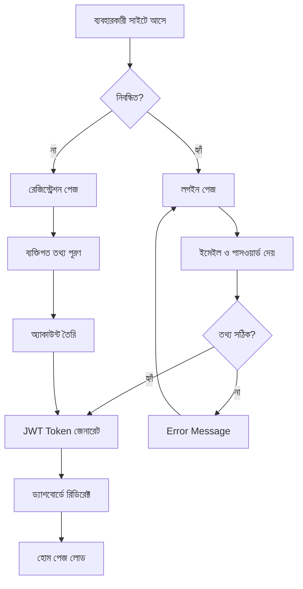
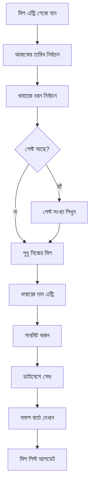
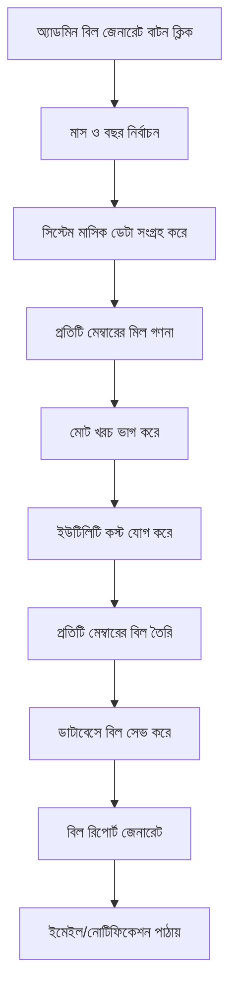
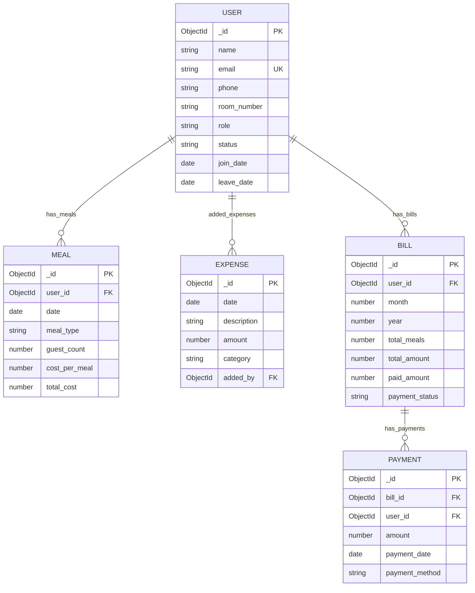
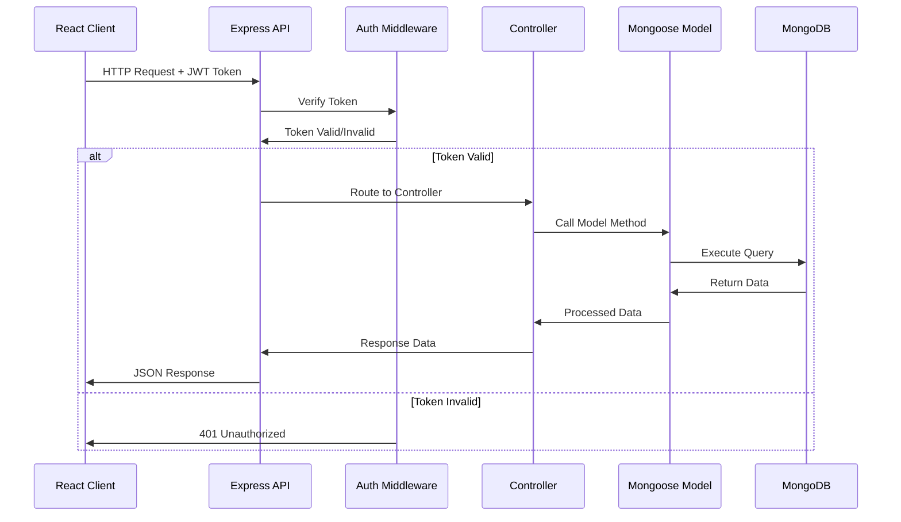
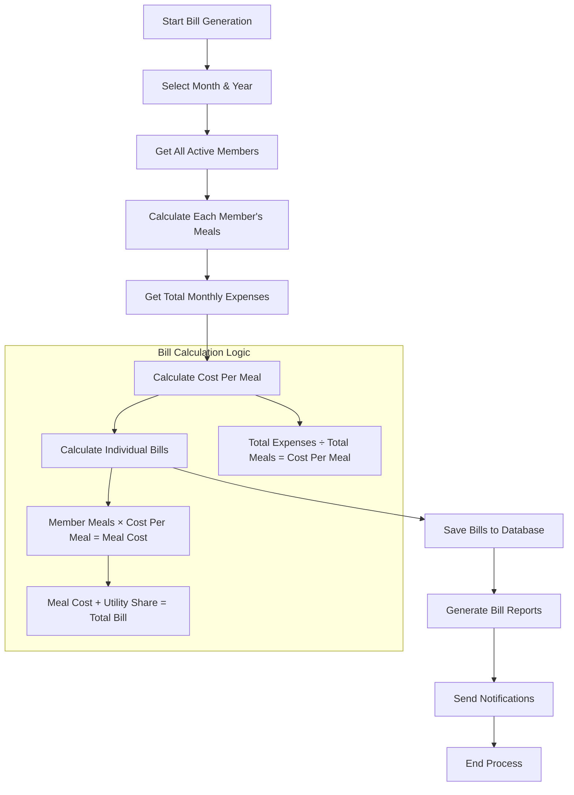
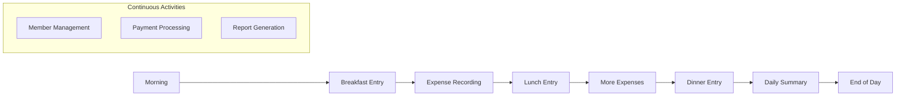
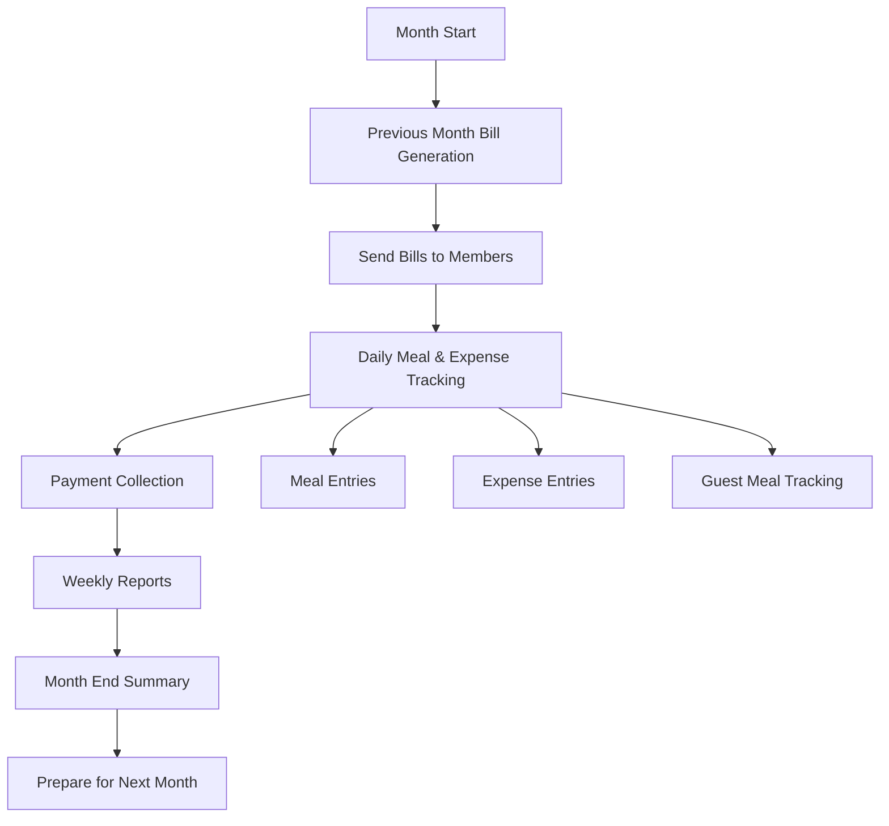
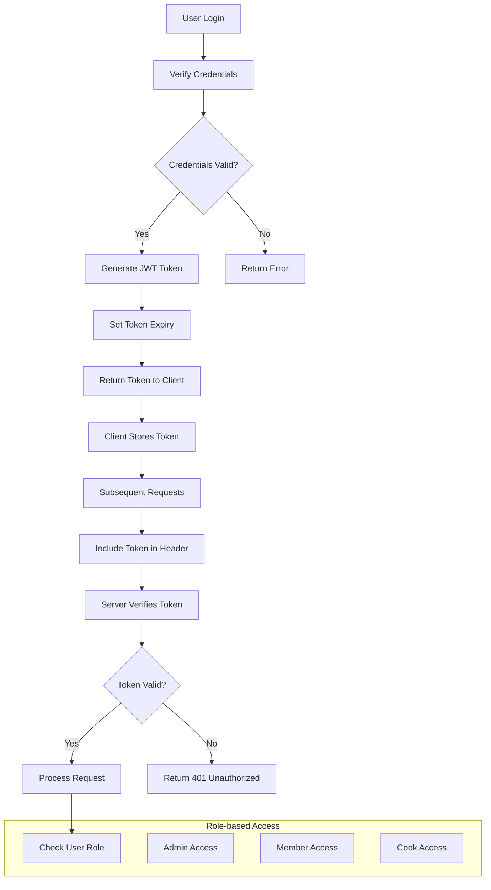
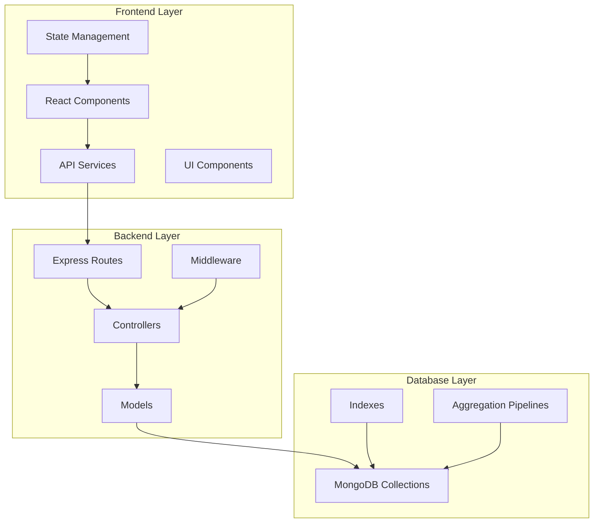

# প্রজেক্ট আর্কিটেকচার ও ডায়াগ্রাম

## 🏗️ সিস্টেম আর্কিটেকচার

### Overall System Architecture

```
┌─────────────────────────────────────────────────────────────────┐
│                        DMMS System Architecture                  │
├─────────────────────────────────────────────────────────────────┤
│                                                                 │
│  ┌─────────────┐    ┌─────────────────┐    ┌─────────────────┐ │
│  │   Frontend  │    │     Backend     │    │    Database     │ │
│  │   (React)   │◄──►│   (Node.js)     │◄──►│   (MongoDB)     │ │
│  │             │    │                 │    │                 │ │
│  │ ┌─────────┐ │    │ ┌─────────────┐ │    │ ┌─────────────┐ │ │
│  │ │Dashboard│ │    │ │ Express API │ │    │ │Collections: │ │ │
│  │ │Members  │ │    │ │Controllers  │ │    │ │• Users      │ │ │
│  │ │Meals    │ │    │ │Middleware   │ │    │ │• Meals      │ │ │
│  │ │Finance  │ │    │ │Routes       │ │    │ │• Expenses   │ │ │
│  │ │Reports  │ │    │ │Models       │ │    │ │• Bills      │ │ │
│  │ └─────────┘ │    │ └─────────────┘ │    │ └─────────────┘ │ │
│  └─────────────┘    └─────────────────┘    └─────────────────┘ │
│                                                                 │
│         ▲                       ▲                       ▲       │
│         │                       │                       │       │
│    HTTP Requests            REST API               MongoDB        │
│    (Axios/Fetch)           (JSON Data)            Queries        │
│                                                                 │
└─────────────────────────────────────────────────────────────────┘
```

## 🔄 User Flow Diagrams

### 1. User Authentication Flow



### 2. Meal Entry Flow



### 3. Monthly Bill Generation Flow



## 💾 Database Schema Design

### User Collection

```javascript
{
  _id: ObjectId("64a1b2c3d4e5f6789012345"),
  name: "আহমেদ হাসান",
  email: "ahmed@email.com",
  phone: "01712345678",
  room_number: "A-205",
  password: "$2b$10$encrypted_password_hash",
  role: "member", // enum: ['admin', 'member', 'cook']
  status: "active", // enum: ['active', 'inactive', 'suspended']
  join_date: ISODate("2025-01-15T00:00:00Z"),
  leave_date: null, // null if still active
  profile_picture: "https://example.com/profiles/ahmed.jpg",
  created_at: ISODate("2025-01-15T10:30:00Z"),
  updated_at: ISODate("2025-05-28T14:20:00Z"),

  // Additional fields for analytics
  last_login: ISODate("2025-05-28T09:15:00Z"),
  total_meals_lifetime: 450,
  total_payments_lifetime: 15000
}
```

### Meal Collection

```javascript
{
  _id: ObjectId("64a1b2c3d4e5f6789012346"),
  user_id: ObjectId("64a1b2c3d4e5f6789012345"),
  date: ISODate("2025-05-28T00:00:00Z"),
  meal_type: "lunch", // enum: ['breakfast', 'lunch', 'dinner']
  guest_count: 2,
  cost_per_meal: 45.00,
  total_cost: 135.00, // (1 + guest_count) * cost_per_meal
  notes: "বিশেষ অনুষ্ঠানের জন্য অতিরিক্ত খাবার",
  created_at: ISODate("2025-05-28T12:30:00Z"),
  updated_at: ISODate("2025-05-28T12:30:00Z"),
  created_by: ObjectId("64a1b2c3d4e5f6789012345"), // who entered this meal

  // For tracking purposes
  is_edited: false,
  edit_history: [] // array of edit logs
}
```

### Expense Collection

```javascript
{
  _id: ObjectId("64a1b2c3d4e5f6789012347"),
  date: ISODate("2025-05-28T00:00:00Z"),
  description: "সবজি কেনা - পালং শাক, গাজর, আলু",
  amount: 850.00,
  category: "groceries", // enum: ['groceries', 'gas', 'utilities', 'maintenance', 'other']
  subcategory: "vegetables", // optional subcategory
  payment_method: "cash", // enum: ['cash', 'bkash', 'bank_transfer', 'card']
  vendor: "স্থানীয় বাজার",
  receipt_image: "https://example.com/receipts/receipt_001.jpg",
  added_by: ObjectId("64a1b2c3d4e5f6789012345"),
  approved_by: ObjectId("64a1b2c3d4e5f6789012340"), // admin approval
  status: "approved", // enum: ['pending', 'approved', 'rejected']
  created_at: ISODate("2025-05-28T14:30:00Z"),
  updated_at: ISODate("2025-05-28T14:30:00Z")
}
```

### Bill Collection

```javascript
{
  _id: ObjectId("64a1b2c3d4e5f6789012348"),
  user_id: ObjectId("64a1b2c3d4e5f6789012345"),
  month: 5,
  year: 2025,

  // Meal calculations
  total_meals: 30,
  meal_rate: 45.00,
  meal_cost: 1350.00, // total_meals * meal_rate

  // Additional costs
  utility_cost: 150.00, // electricity, gas, water per member
  service_charge: 50.00, // cook salary, cleaning etc.
  maintenance_cost: 25.00, // repairs, improvements

  // Total calculation
  subtotal: 1575.00, // meal_cost + utility_cost + service_charge + maintenance_cost
  discount: 0.00, // any discount applied
  total_amount: 1575.00, // subtotal - discount

  // Payment tracking
  paid_amount: 1000.00,
  due_amount: 575.00, // total_amount - paid_amount
  payment_status: "partial", // enum: ['paid', 'partial', 'unpaid']

  // Payment history
  payments: [
    {
      amount: 500.00,
      payment_date: ISODate("2025-05-05T00:00:00Z"),
      payment_method: "bkash",
      transaction_id: "BKP123456789",
      received_by: ObjectId("64a1b2c3d4e5f6789012340")
    },
    {
      amount: 500.00,
      payment_date: ISODate("2025-05-15T00:00:00Z"),
      payment_method: "cash",
      received_by: ObjectId("64a1b2c3d4e5f6789012340")
    }
  ],

  // Bill metadata
  generated_at: ISODate("2025-06-01T10:00:00Z"),
  generated_by: ObjectId("64a1b2c3d4e5f6789012340"),
  due_date: ISODate("2025-06-10T00:00:00Z"),
  is_final: true, // false if bill can still be modified

  created_at: ISODate("2025-06-01T10:00:00Z"),
  updated_at: ISODate("2025-05-15T16:30:00Z")
}
```

### Menu Collection (Optional - for meal planning)

```javascript
{
  _id: ObjectId("64a1b2c3d4e5f6789012349"),
  date: ISODate("2025-05-28T00:00:00Z"),
  meal_type: "lunch",
  items: [
    {
      name: "ভাত",
      type: "main",
      quantity: "অল্ড"
    },
    {
      name: "মুরগির মাংস",
      type: "curry",
      quantity: "১ কেজি"
    },
    {
      name: "ডাল",
      type: "curry",
      quantity: "৫০০ গ্রাম"
    }
  ],
  estimated_cost: 45.00,
  actual_cost: 47.00,
  cook_id: ObjectId("64a1b2c3d4e5f6789012341"),
  created_at: ISODate("2025-05-27T20:00:00Z")
}
```

## 📊 Database Relationships

### Entity Relationship Diagram



## 🔄 Data Flow Architecture

### 1. Request-Response Cycle



### 2. Bill Generation Process



## 🏃‍♂️ Application Workflow

### Daily Operations Workflow



### Monthly Operations Workflow



## 🔐 Security Architecture

### Authentication & Authorization Flow



## 📱 Component Architecture (Frontend)

### React Component Hierarchy

```
App
├── Router
├── AuthProvider
├── ThemeProvider
└── Layout
    ├── Header
    │   ├── Navigation
    │   ├── UserProfile
    │   └── Notifications
    ├── Sidebar
    │   ├── MenuItems
    │   └── UserInfo
    └── MainContent
        ├── Dashboard
        │   ├── SummaryCards
        │   ├── RecentActivities
        │   └── QuickActions
        ├── Members
        │   ├── MemberList
        │   ├── MemberForm
        │   └── MemberDetails
        ├── Meals
        │   ├── MealEntry
        │   ├── MealHistory
        │   └── DailyMenu
        ├── Finance
        │   ├── ExpenseEntry
        │   ├── BillGeneration
        │   ├── PaymentTracking
        │   └── FinancialReports
        └── Reports
            ├── DashboardReports
            ├── MonthlyReports
            └── CustomReports
```

## 🔧 Technical Stack Integration

### Full Stack Integration



---

এই আর্কিটেকচার ডকুমেন্ট আপনার প্রজেক্টের সম্পূর্ণ কাঠামো এবং data flow বুঝতে সাহায্য করবে। প্রতিটি component এর ভূমিকা এবং তাদের মধ্যে সম্পর্ক স্পষ্টভাবে দেখানো হয়েছে।
