# 🏗️ ডিজিটাল মেস ম্যানেজমেন্ট সিস্টেম V2.0 - Architecture Diagrams

**Professional System Architecture for Production-Ready Mess Management**


---# 🏗️ ডিজিটাল মেস ম্যানেজমেন্ট সিস্টেম V2.0 - Architecture Diagrams

**Professional System Architecture for Production-Ready Mess Management**


---

## 🎯 System Architecture Overview

### 🌐 High-Level Architecture# 🏗️ ডিজিটাল মেস ম্যানেজমেন্ট সিস্টেম V2.0 - Architecture Diagrams

**Professional System Architecture for Production-Ready Mess Management**


---

## 🎯 System Architecture Overview

### 🌐 High-Level Architecture

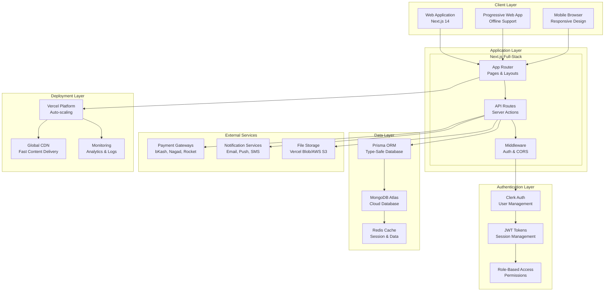

---

## 🏢 Application Architecture

### 📱 Next.js 14 App Router Structure

```mermaid
graph LR
    subgraph "App Router Structure"
        ROOT[app/]

        subgraph "Public Routes"
            HOME[page.tsx<br/>Landing Page]
            ABOUT[about/page.tsx<br/>About Page]
        end

        subgraph "Authentication Routes"
            AUTH[(auth)/]
            SIGNIN[sign-in/page.tsx]
            SIGNUP[sign-up/page.tsx]
        end

        subgraph "Protected Routes"
            DASH[dashboard/]
            ADMIN[admin/page.tsx]
            MEALS[meals/page.tsx]
            BAZAAR[bazaar/page.tsx]
            BILLS[bills/page.tsx]
            REPORTS[reports/page.tsx]
            SETTINGS[settings/page.tsx]
        end

        subgraph "API Routes"
            API[api/]
            MESS_API[mess/route.ts]
            MEAL_API[meals/route.ts]
            BAZAAR_API[bazaar/route.ts]
            BILL_API[bills/route.ts]
            PAY_API[payments/route.ts]
            WEBHOOK[webhooks/clerk/route.ts]
        end
    end

    ROOT --> HOME
    ROOT --> ABOUT
    ROOT --> AUTH
    ROOT --> DASH
    ROOT --> API

    AUTH --> SIGNIN
    AUTH --> SIGNUP

    DASH --> ADMIN
    DASH --> MEALS
    DASH --> BAZAAR
    DASH --> BILLS
    DASH --> REPORTS
    DASH --> SETTINGS

    API --> MESS_API
    API --> MEAL_API
    API --> BAZAAR_API
    API --> BILL_API
    API --> PAY_API
    API --> WEBHOOK
```

### 🔧 Component Architecture

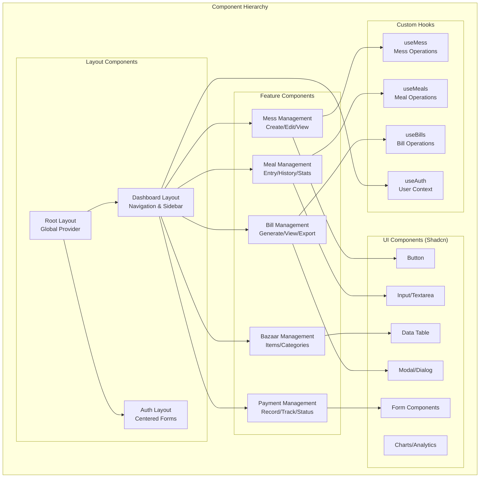

---

## 🗄️ Database Architecture

### 📊 MongoDB Schema Design

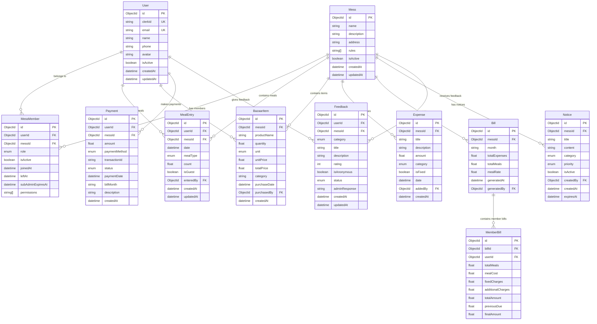

### 🔍 Database Indexing Strategy

```typescript
// Optimal Indexes for Performance
const indexes = {
  // User indexes
  users: [
    { clerkId: 1 }, // Unique index for authentication
    { email: 1 }, // Unique index for user lookup
    { isActive: 1 }, // Filter active users
  ],

  // Mess indexes
  messes: [
    { isActive: 1 }, // Filter active messes
    { createdAt: -1 }, // Sort by creation date
  ],

  // MessMember indexes
  mess_members: [
    { userId: 1, messId: 1 }, // Composite unique index
    { messId: 1, role: 1 }, // Filter by mess and role
    { messId: 1, isActive: 1 }, // Filter active members
    { subAdminExpiresAt: 1 }, // TTL for sub-admin expiry
  ],

  // MealEntry indexes
  meal_entries: [
    { userId: 1, messId: 1, date: -1 }, // User meal history
    { messId: 1, date: -1 }, // Mess meal history
    { messId: 1, date: 1, mealType: 1 }, // Daily meal queries
    { date: 1, mealType: 1 }, // Global meal statistics
  ],

  // BazaarItem indexes
  bazaar_items: [
    { messId: 1, purchaseDate: -1 }, // Mess bazaar history
    { messId: 1, category: 1 }, // Category-wise items
    { purchaseDate: -1 }, // Recent purchases
    { productName: "text" }, // Text search on products
  ],

  // Expense indexes
  expenses: [
    { messId: 1, date: -1 }, // Mess expenses by date
    { messId: 1, category: 1 }, // Expenses by category
    { messId: 1, isFixed: 1 }, // Fixed vs variable expenses
    { date: -1 }, // Global expense trends
  ],

  // Bill indexes
  bills: [
    { messId: 1, month: -1 }, // Mess bills by month
    { month: 1 }, // Global monthly bills
    { generatedAt: -1 }, // Recent bill generation
  ],

  // Payment indexes
  payments: [
    { userId: 1, billMonth: -1 }, // User payment history
    { messId: 1, billMonth: -1 }, // Mess payment tracking
    { status: 1, paymentDate: -1 }, // Payment status queries
    { transactionId: 1 }, // Transaction lookup
  ],

  // Notice indexes
  notices: [
    { messId: 1, isActive: 1, priority: -1 }, // Active notices by priority
    { messId: 1, category: 1 }, // Notices by category
    { expiresAt: 1 }, // TTL for notice expiry
  ],

  // Feedback indexes
  feedbacks: [
    { messId: 1, status: 1, createdAt: -1 }, // Feedback management
    { messId: 1, category: 1, rating: -1 }, // Feedback analytics
    { userId: 1, createdAt: -1 }, // User feedback history
  ],
};
```

---

## 🔐 Security Architecture

### 🛡️ Authentication & Authorization Flow

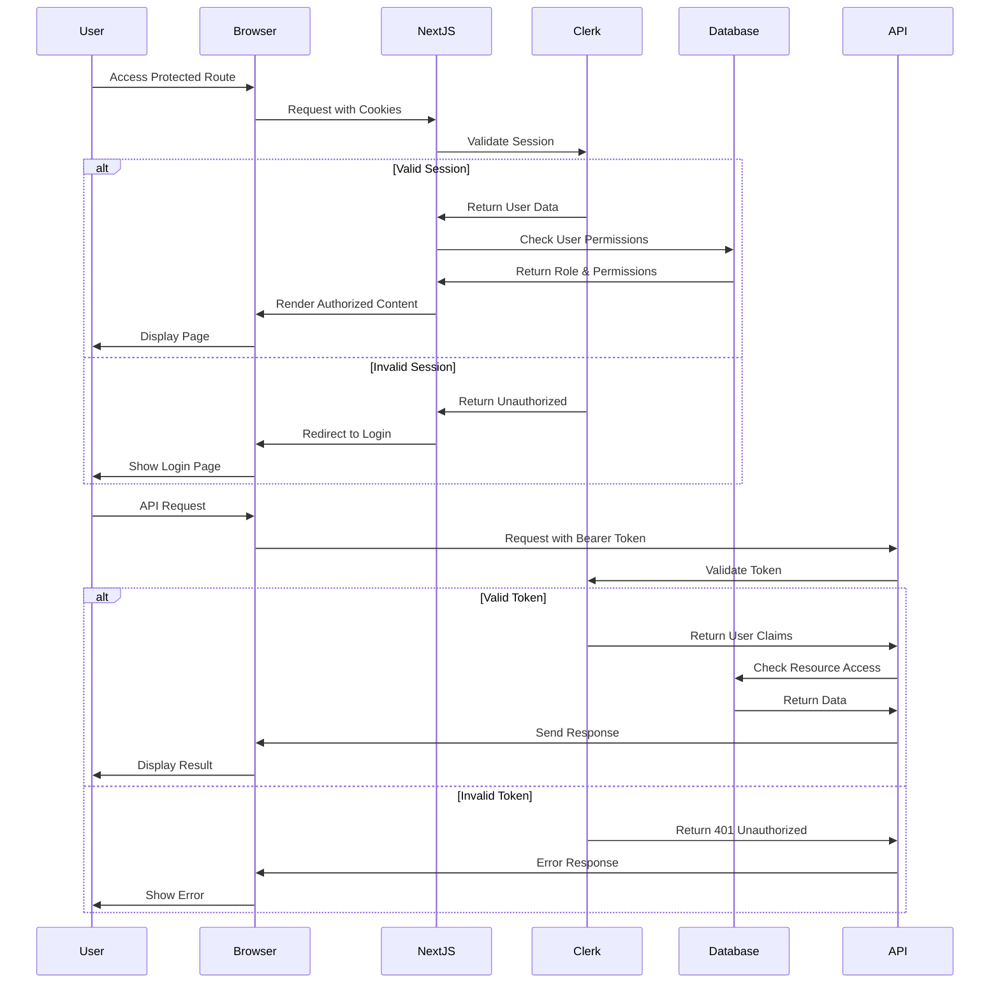

### 🔒 Role-Based Access Control (RBAC)

```mermaid
graph TB
    subgraph "Role Hierarchy"
        ADMIN[ADMIN<br/>Full Access]
        SUB_ADMIN[SUB_ADMIN<br/>Limited Time Access]
        COOK[COOK<br/>Kitchen Management]
        MEMBER[MEMBER<br/>Basic Access]
    end

    subgraph "Permissions Matrix"
        subgraph "Mess Management"
            CREATE_MESS[Create Mess]
            EDIT_MESS[Edit Mess]
            DELETE_MESS[Delete Mess]
            MANAGE_MEMBERS[Manage Members]
        end

        subgraph "Meal Management"
            ADD_MEAL[Add Meal Entry]
            EDIT_MEAL[Edit Meal Entry]
            VIEW_ALL_MEALS[View All Meals]
            DELETE_MEAL[Delete Meal Entry]
        end

        subgraph "Financial Management"
            ADD_EXPENSE[Add Expense]
            GENERATE_BILL[Generate Bill]
            VIEW_FINANCIAL[View Financial Reports]
            MANAGE_PAYMENTS[Manage Payments]
        end

        subgraph "Content Management"
            CREATE_NOTICE[Create Notice]
            RESPOND_FEEDBACK[Respond to Feedback]
            MODERATE_CONTENT[Moderate Content]
        end
    end

    ADMIN --> CREATE_MESS
    ADMIN --> EDIT_MESS
    ADMIN --> DELETE_MESS
    ADMIN --> MANAGE_MEMBERS
    ADMIN --> ADD_MEAL
    ADMIN --> EDIT_MEAL
    ADMIN --> VIEW_ALL_MEALS
    ADMIN --> DELETE_MEAL
    ADMIN --> ADD_EXPENSE
    ADMIN --> GENERATE_BILL
    ADMIN --> VIEW_FINANCIAL
    ADMIN --> MANAGE_PAYMENTS
    ADMIN --> CREATE_NOTICE
    ADMIN --> RESPOND_FEEDBACK
    ADMIN --> MODERATE_CONTENT

    SUB_ADMIN --> ADD_MEAL
    SUB_ADMIN --> EDIT_MEAL
    SUB_ADMIN --> VIEW_ALL_MEALS
    SUB_ADMIN --> ADD_EXPENSE

    COOK --> ADD_MEAL
    COOK --> VIEW_ALL_MEALS
    COOK --> CREATE_NOTICE

    MEMBER --> ADD_MEAL
    MEMBER --> VIEW_ALL_MEALS
```

---

## 🚀 Deployment Architecture

### ☁️ Vercel Deployment Strategy

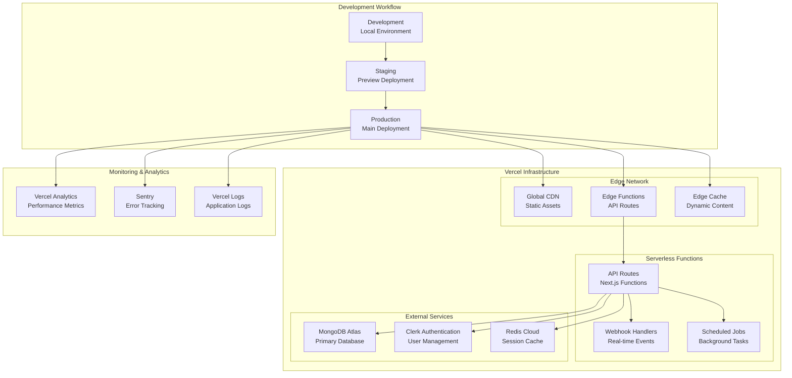

### 🌍 Global Distribution

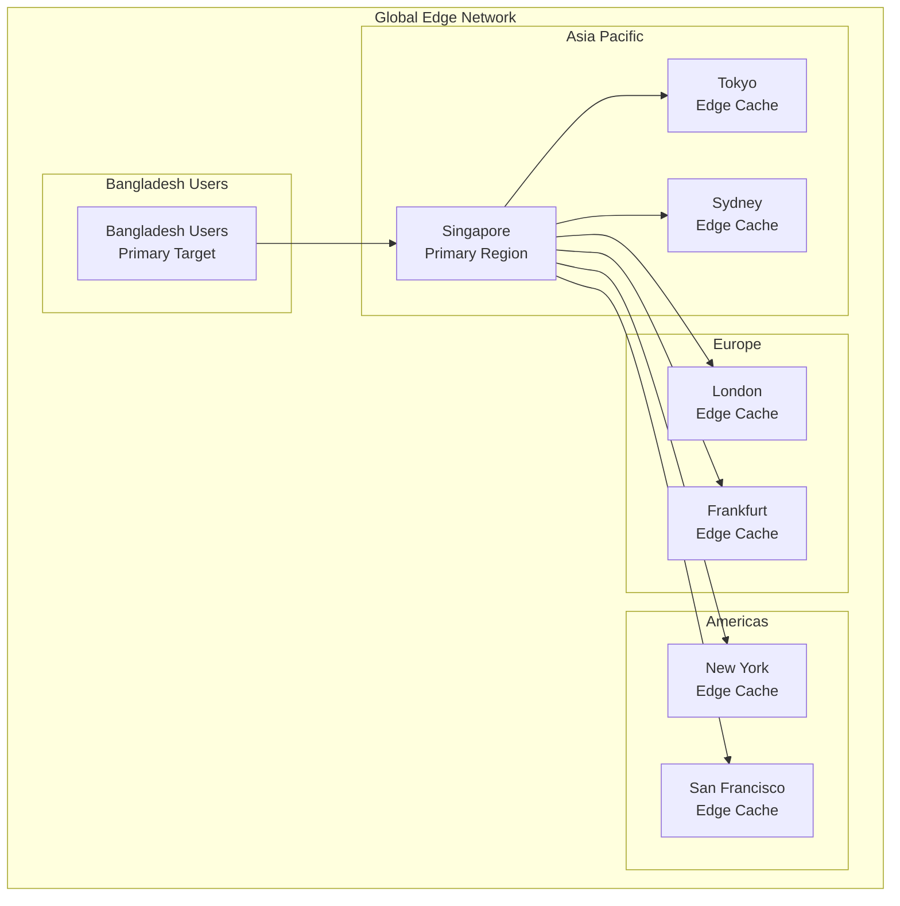

---

## 📱 Progressive Web App (PWA) Architecture

### 🔄 Offline Strategy

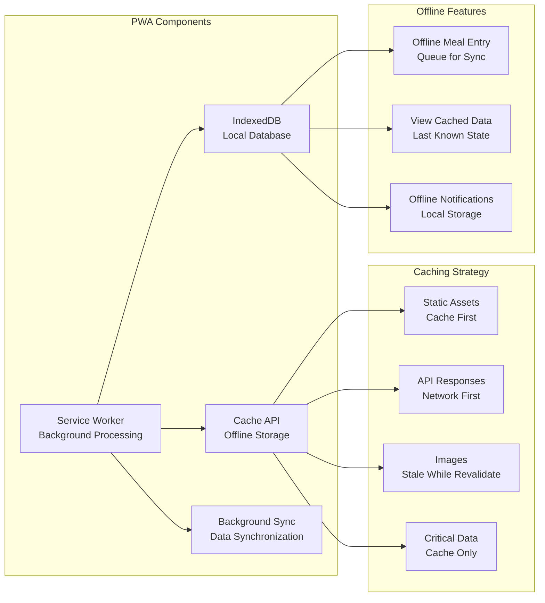

### 📲 Mobile Experience

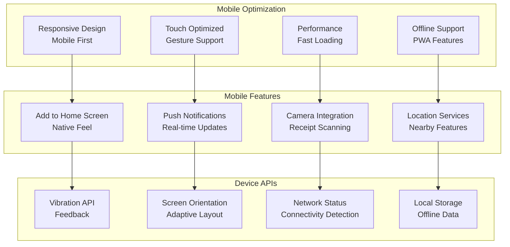

---

## 🔄 Data Flow Architecture

### 📊 Real-time Data Synchronization

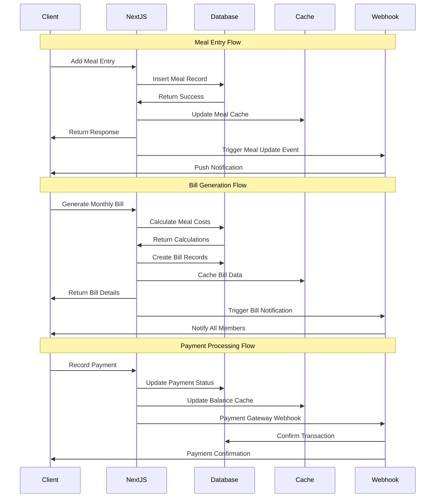

### 🔄 State Management Flow

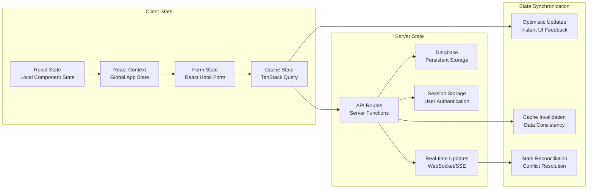

---

## 🔧 Development Architecture

### 🛠️ Development Workflow

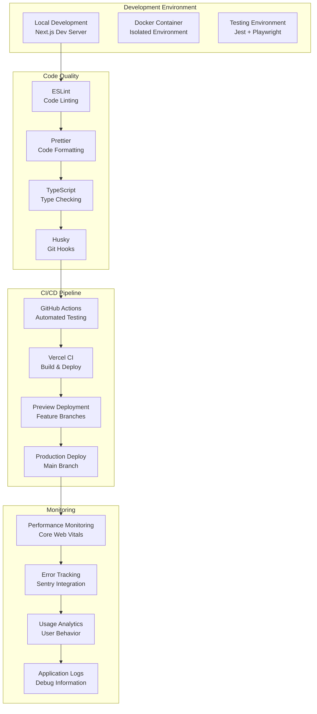

### 🧪 Testing Architecture

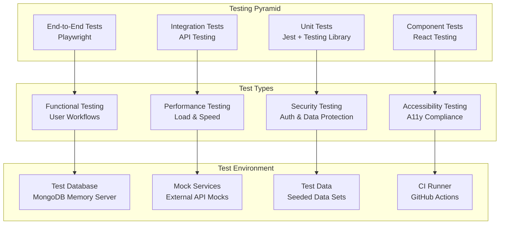

---

## 📊 Performance Architecture

### ⚡ Performance Optimization Strategy

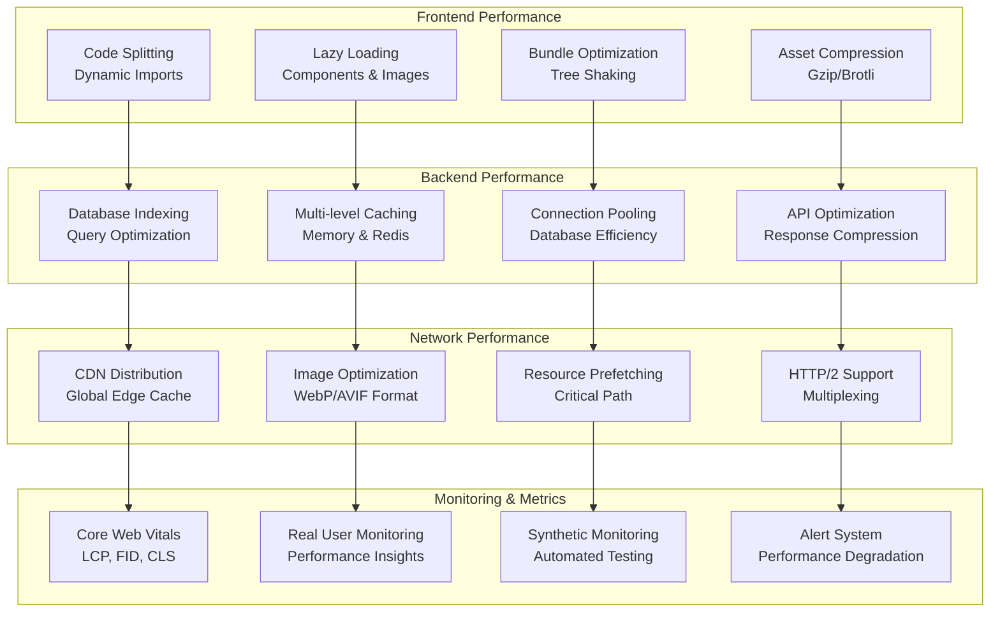

---

## 🔍 Analytics Architecture

### 📈 Data Analytics Pipeline

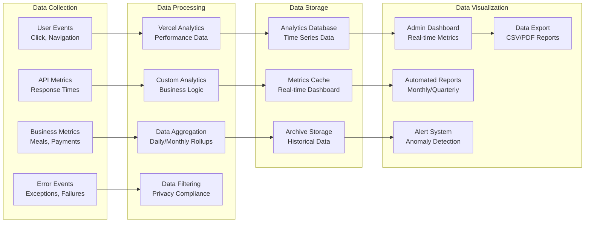

---

**🎯 This comprehensive architecture documentation provides the complete technical blueprint for building the professional Mess Management System V2.0. The architecture is designed for scalability, security, and optimal performance in production environments.**

---

_Architecture Version: 2.0.0_
_Last Updated: May 29, 2025_
_Framework: Next.js 14 with Modern Architecture Patterns_


---

## 🏢 Application Architecture

### 📱 Next.js 14 App Router Structure

```mermaid
graph LR
    subgraph "App Router Structure"
        ROOT[app/]

        subgraph "Public Routes"
            HOME[page.tsx<br/>Landing Page]
            ABOUT[about/page.tsx<br/>About Page]
        end

        subgraph "Authentication Routes"
            AUTH[(auth)/]
            SIGNIN[sign-in/page.tsx]
            SIGNUP[sign-up/page.tsx]
        end

        subgraph "Protected Routes"
            DASH[dashboard/]
            ADMIN[admin/page.tsx]
            MEALS[meals/page.tsx]
            BAZAAR[bazaar/page.tsx]
            BILLS[bills/page.tsx]
            REPORTS[reports/page.tsx]
            SETTINGS[settings/page.tsx]
        end

        subgraph "API Routes"
            API[api/]
            MESS_API[mess/route.ts]
            MEAL_API[meals/route.ts]
            BAZAAR_API[bazaar/route.ts]
            BILL_API[bills/route.ts]
            PAY_API[payments/route.ts]
            WEBHOOK[webhooks/clerk/route.ts]
        end
    end

    ROOT --> HOME
    ROOT --> ABOUT
    ROOT --> AUTH
    ROOT --> DASH
    ROOT --> API

    AUTH --> SIGNIN
    AUTH --> SIGNUP

    DASH --> ADMIN
    DASH --> MEALS
    DASH --> BAZAAR
    DASH --> BILLS
    DASH --> REPORTS
    DASH --> SETTINGS

    API --> MESS_API
    API --> MEAL_API
    API --> BAZAAR_API
    API --> BILL_API
    API --> PAY_API
    API --> WEBHOOK
```

### 🔧 Component Architecture


---

## 🗄️ Database Architecture

### 📊 MongoDB Schema Design

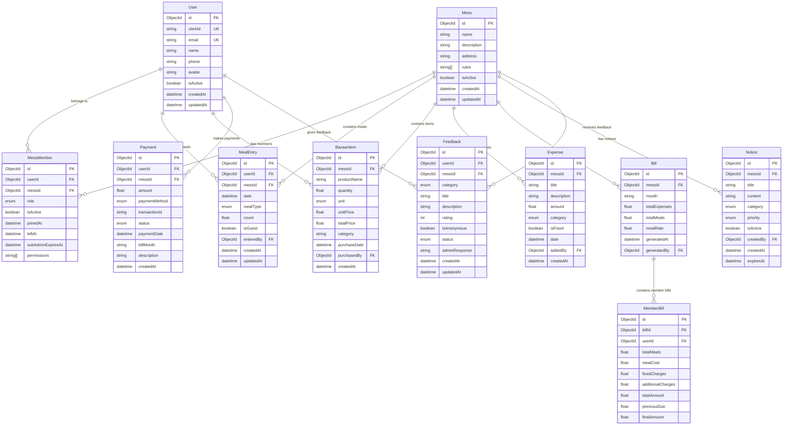

### 🔍 Database Indexing Strategy

```typescript
// Optimal Indexes for Performance
const indexes = {
  // User indexes
  users: [
    { clerkId: 1 }, // Unique index for authentication
    { email: 1 }, // Unique index for user lookup
    { isActive: 1 }, // Filter active users
  ],

  // Mess indexes
  messes: [
    { isActive: 1 }, // Filter active messes
    { createdAt: -1 }, // Sort by creation date
  ],

  // MessMember indexes
  mess_members: [
    { userId: 1, messId: 1 }, // Composite unique index
    { messId: 1, role: 1 }, // Filter by mess and role
    { messId: 1, isActive: 1 }, // Filter active members
    { subAdminExpiresAt: 1 }, // TTL for sub-admin expiry
  ],

  // MealEntry indexes
  meal_entries: [
    { userId: 1, messId: 1, date: -1 }, // User meal history
    { messId: 1, date: -1 }, // Mess meal history
    { messId: 1, date: 1, mealType: 1 }, // Daily meal queries
    { date: 1, mealType: 1 }, // Global meal statistics
  ],

  // BazaarItem indexes
  bazaar_items: [
    { messId: 1, purchaseDate: -1 }, // Mess bazaar history
    { messId: 1, category: 1 }, // Category-wise items
    { purchaseDate: -1 }, // Recent purchases
    { productName: "text" }, // Text search on products
  ],

  // Expense indexes
  expenses: [
    { messId: 1, date: -1 }, // Mess expenses by date
    { messId: 1, category: 1 }, // Expenses by category
    { messId: 1, isFixed: 1 }, // Fixed vs variable expenses
    { date: -1 }, // Global expense trends
  ],

  // Bill indexes
  bills: [
    { messId: 1, month: -1 }, // Mess bills by month
    { month: 1 }, // Global monthly bills
    { generatedAt: -1 }, // Recent bill generation
  ],

  // Payment indexes
  payments: [
    { userId: 1, billMonth: -1 }, // User payment history
    { messId: 1, billMonth: -1 }, // Mess payment tracking
    { status: 1, paymentDate: -1 }, // Payment status queries
    { transactionId: 1 }, // Transaction lookup
  ],

  // Notice indexes
  notices: [
    { messId: 1, isActive: 1, priority: -1 }, // Active notices by priority
    { messId: 1, category: 1 }, // Notices by category
    { expiresAt: 1 }, // TTL for notice expiry
  ],

  // Feedback indexes
  feedbacks: [
    { messId: 1, status: 1, createdAt: -1 }, // Feedback management
    { messId: 1, category: 1, rating: -1 }, // Feedback analytics
    { userId: 1, createdAt: -1 }, // User feedback history
  ],
};
```

---

## 🔐 Security Architecture

### 🛡️ Authentication & Authorization Flow

```mermaid
sequenceDiagram
    participant User
    participant Browser
    participant NextJS
    participant Clerk
    participant Database
    participant API

    User->>Browser: Access Protected Route
    Browser->>NextJS: Request with Cookies
    NextJS->>Clerk: Validate Session

    alt Valid Session
        Clerk->>NextJS: Return User Data
        NextJS->>Database: Check User Permissions
        Database->>NextJS: Return Role & Permissions
        NextJS->>Browser: Render Authorized Content
        Browser->>User: Display Page
    else Invalid Session
        Clerk->>NextJS: Return Unauthorized
        NextJS->>Browser: Redirect to Login
        Browser->>User: Show Login Page
    end

    User->>Browser: API Request
    Browser->>API: Request with Bearer Token
    API->>Clerk: Validate Token

    alt Valid Token
        Clerk->>API: Return User Claims
        API->>Database: Check Resource Access
        Database->>API: Return Data
        API->>Browser: Send Response
        Browser->>User: Display Result
    else Invalid Token
        Clerk->>API: Return 401 Unauthorized
        API->>Browser: Error Response
        Browser->>User: Show Error
    end
```

### 🔒 Role-Based Access Control (RBAC)

```mermaid
graph TB
    subgraph "Role Hierarchy"
        ADMIN[ADMIN<br/>Full Access]
        SUB_ADMIN[SUB_ADMIN<br/>Limited Time Access]
        COOK[COOK<br/>Kitchen Management]
        MEMBER[MEMBER<br/>Basic Access]
    end

    subgraph "Permissions Matrix"
        subgraph "Mess Management"
            CREATE_MESS[Create Mess]
            EDIT_MESS[Edit Mess]
            DELETE_MESS[Delete Mess]
            MANAGE_MEMBERS[Manage Members]
        end

        subgraph "Meal Management"
            ADD_MEAL[Add Meal Entry]
            EDIT_MEAL[Edit Meal Entry]
            VIEW_ALL_MEALS[View All Meals]
            DELETE_MEAL[Delete Meal Entry]
        end

        subgraph "Financial Management"
            ADD_EXPENSE[Add Expense]
            GENERATE_BILL[Generate Bill]
            VIEW_FINANCIAL[View Financial Reports]
            MANAGE_PAYMENTS[Manage Payments]
        end

        subgraph "Content Management"
            CREATE_NOTICE[Create Notice]
            RESPOND_FEEDBACK[Respond to Feedback]
            MODERATE_CONTENT[Moderate Content]
        end
    end

    ADMIN --> CREATE_MESS
    ADMIN --> EDIT_MESS
    ADMIN --> DELETE_MESS
    ADMIN --> MANAGE_MEMBERS
    ADMIN --> ADD_MEAL
    ADMIN --> EDIT_MEAL
    ADMIN --> VIEW_ALL_MEALS
    ADMIN --> DELETE_MEAL
    ADMIN --> ADD_EXPENSE
    ADMIN --> GENERATE_BILL
    ADMIN --> VIEW_FINANCIAL
    ADMIN --> MANAGE_PAYMENTS
    ADMIN --> CREATE_NOTICE
    ADMIN --> RESPOND_FEEDBACK
    ADMIN --> MODERATE_CONTENT

    SUB_ADMIN --> ADD_MEAL
    SUB_ADMIN --> EDIT_MEAL
    SUB_ADMIN --> VIEW_ALL_MEALS
    SUB_ADMIN --> ADD_EXPENSE

    COOK --> ADD_MEAL
    COOK --> VIEW_ALL_MEALS
    COOK --> CREATE_NOTICE

    MEMBER --> ADD_MEAL
    MEMBER --> VIEW_ALL_MEALS
```

---

## 🚀 Deployment Architecture

### ☁️ Vercel Deployment Strategy

```mermaid
graph TB
    subgraph "Development Workflow"
        DEV[Development<br/>Local Environment]
        STAGING[Staging<br/>Preview Deployment]
        PROD[Production<br/>Main Deployment]
    end

    subgraph "Vercel Infrastructure"
        subgraph "Edge Network"
            CDN[Global CDN<br/>Static Assets]
            EDGE[Edge Functions<br/>API Routes]
            CACHE[Edge Cache<br/>Dynamic Content]
        end

        subgraph "Serverless Functions"
            API_FUNC[API Routes<br/>Next.js Functions]
            WEBHOOK[Webhook Handlers<br/>Real-time Events]
            CRON[Scheduled Jobs<br/>Background Tasks]
        end

        subgraph "External Services"
            MONGO_ATLAS[MongoDB Atlas<br/>Primary Database]
            CLERK_AUTH[Clerk Authentication<br/>User Management]
            REDIS_CACHE[Redis Cloud<br/>Session Cache]
        end
    end

    subgraph "Monitoring & Analytics"
        VERCEL_ANALYTICS[Vercel Analytics<br/>Performance Metrics]
        SENTRY[Sentry<br/>Error Tracking]
        LOGS[Vercel Logs<br/>Application Logs]
    end

    DEV --> STAGING
    STAGING --> PROD

    PROD --> CDN
    PROD --> EDGE
    PROD --> CACHE

    EDGE --> API_FUNC
    API_FUNC --> WEBHOOK
    API_FUNC --> CRON

    API_FUNC --> MONGO_ATLAS
    API_FUNC --> CLERK_AUTH
    API_FUNC --> REDIS_CACHE

    PROD --> VERCEL_ANALYTICS
    PROD --> SENTRY
    PROD --> LOGS
```

### 🌍 Global Distribution

```mermaid
graph TB
    subgraph "Global Edge Network"
        subgraph "Asia Pacific"
            SG[Singapore<br/>Primary Region]
            TOK[Tokyo<br/>Edge Cache]
            SYD[Sydney<br/>Edge Cache]
        end

        subgraph "Europe"
            LDN[London<br/>Edge Cache]
            FRA[Frankfurt<br/>Edge Cache]
        end

        subgraph "Americas"
            NYC[New York<br/>Edge Cache]
            SF[San Francisco<br/>Edge Cache]
        end

        subgraph "Bangladesh Users"
            BD_USERS[Bangladesh Users<br/>Primary Target]
        end
    end

    BD_USERS --> SG
    SG --> TOK
    SG --> SYD
    SG --> LDN
    SG --> FRA
    SG --> NYC
    SG --> SF
```

---

## 📱 Progressive Web App (PWA) Architecture

### 🔄 Offline Strategy

```mermaid
graph LR
    subgraph "PWA Components"
        SW[Service Worker<br/>Background Processing]
        CACHE_API[Cache API<br/>Offline Storage]
        IDB[IndexedDB<br/>Local Database]
        SYNC[Background Sync<br/>Data Synchronization]
    end

    subgraph "Caching Strategy"
        STATIC[Static Assets<br/>Cache First]
        API[API Responses<br/>Network First]
        IMAGES[Images<br/>Stale While Revalidate]
        CRITICAL[Critical Data<br/>Cache Only]
    end

    subgraph "Offline Features"
        MEAL_ENTRY[Offline Meal Entry<br/>Queue for Sync]
        VIEW_DATA[View Cached Data<br/>Last Known State]
        NOTIFICATIONS[Offline Notifications<br/>Local Storage]
    end

    SW --> CACHE_API
    SW --> IDB
    SW --> SYNC

    CACHE_API --> STATIC
    CACHE_API --> API
    CACHE_API --> IMAGES
    CACHE_API --> CRITICAL

    IDB --> MEAL_ENTRY
    IDB --> VIEW_DATA
    IDB --> NOTIFICATIONS
```

### 📲 Mobile Experience

```mermaid
graph TB
    subgraph "Mobile Optimization"
        RESPONSIVE[Responsive Design<br/>Mobile First]
        TOUCH[Touch Optimized<br/>Gesture Support]
        PERF[Performance<br/>Fast Loading]
        OFFLINE[Offline Support<br/>PWA Features]
    end

    subgraph "Mobile Features"
        INSTALL[Add to Home Screen<br/>Native Feel]
        PUSH[Push Notifications<br/>Real-time Updates]
        CAMERA[Camera Integration<br/>Receipt Scanning]
        GPS[Location Services<br/>Nearby Features]
    end

    subgraph "Device APIs"
        VIBRATION[Vibration API<br/>Feedback]
        ORIENTATION[Screen Orientation<br/>Adaptive Layout]
        NETWORK[Network Status<br/>Connectivity Detection]
        STORAGE[Local Storage<br/>Offline Data]
    end

    RESPONSIVE --> INSTALL
    TOUCH --> PUSH
    PERF --> CAMERA
    OFFLINE --> GPS

    INSTALL --> VIBRATION
    PUSH --> ORIENTATION
    CAMERA --> NETWORK
    GPS --> STORAGE
```

---

## 🔄 Data Flow Architecture

### 📊 Real-time Data Synchronization

```mermaid
sequenceDiagram
    participant Client
    participant NextJS
    participant Database
    participant Cache
    participant Webhook

    Note over Client,Webhook: Meal Entry Flow
    Client->>NextJS: Add Meal Entry
    NextJS->>Database: Insert Meal Record
    Database->>NextJS: Return Success
    NextJS->>Cache: Update Meal Cache
    NextJS->>Client: Return Response
    NextJS->>Webhook: Trigger Meal Update Event
    Webhook->>Client: Push Notification

    Note over Client,Webhook: Bill Generation Flow
    Client->>NextJS: Generate Monthly Bill
    NextJS->>Database: Calculate Meal Costs
    Database->>NextJS: Return Calculations
    NextJS->>Database: Create Bill Records
    NextJS->>Cache: Cache Bill Data
    NextJS->>Client: Return Bill Details
    NextJS->>Webhook: Trigger Bill Notification
    Webhook->>Client: Notify All Members

    Note over Client,Webhook: Payment Processing Flow
    Client->>NextJS: Record Payment
    NextJS->>Database: Update Payment Status
    NextJS->>Cache: Update Balance Cache
    NextJS->>Webhook: Payment Gateway Webhook
    Webhook->>Database: Confirm Transaction
    Webhook->>Client: Payment Confirmation
```

### 🔄 State Management Flow

```mermaid
graph LR
    subgraph "Client State"
        REACT_STATE[React State<br/>Local Component State]
        CONTEXT[React Context<br/>Global App State]
        FORM_STATE[Form State<br/>React Hook Form]
        CACHE_STATE[Cache State<br/>TanStack Query]
    end

    subgraph "Server State"
        API_ROUTES[API Routes<br/>Server Functions]
        DATABASE[Database<br/>Persistent Storage]
        SESSION[Session Storage<br/>User Authentication]
        REAL_TIME[Real-time Updates<br/>WebSocket/SSE]
    end

    subgraph "State Synchronization"
        OPTIMISTIC[Optimistic Updates<br/>Instant UI Feedback]
        INVALIDATION[Cache Invalidation<br/>Data Consistency]
        RECONCILIATION[State Reconciliation<br/>Conflict Resolution]
    end

    REACT_STATE --> CONTEXT
    CONTEXT --> FORM_STATE
    FORM_STATE --> CACHE_STATE

    CACHE_STATE --> API_ROUTES
    API_ROUTES --> DATABASE
    API_ROUTES --> SESSION
    API_ROUTES --> REAL_TIME

    CACHE_STATE --> OPTIMISTIC
    API_ROUTES --> INVALIDATION
    REAL_TIME --> RECONCILIATION
```

---

## 🔧 Development Architecture

### 🛠️ Development Workflow

```mermaid
graph TB
    subgraph "Development Environment"
        LOCAL[Local Development<br/>Next.js Dev Server]
        DOCKER[Docker Container<br/>Isolated Environment]
        TESTING[Testing Environment<br/>Jest + Playwright]
    end

    subgraph "Code Quality"
        ESLINT[ESLint<br/>Code Linting]
        PRETTIER[Prettier<br/>Code Formatting]
        TYPESCRIPT[TypeScript<br/>Type Checking]
        HUSKY[Husky<br/>Git Hooks]
    end

    subgraph "CI/CD Pipeline"
        GITHUB[GitHub Actions<br/>Automated Testing]
        VERCEL_CI[Vercel CI<br/>Build & Deploy]
        PREVIEW[Preview Deployment<br/>Feature Branches]
        PRODUCTION[Production Deploy<br/>Main Branch]
    end

    subgraph "Monitoring"
        PERFORMANCE[Performance Monitoring<br/>Core Web Vitals]
        ERROR_TRACKING[Error Tracking<br/>Sentry Integration]
        ANALYTICS[Usage Analytics<br/>User Behavior]
        LOGS[Application Logs<br/>Debug Information]
    end

    LOCAL --> ESLINT
    ESLINT --> PRETTIER
    PRETTIER --> TYPESCRIPT
    TYPESCRIPT --> HUSKY

    HUSKY --> GITHUB
    GITHUB --> VERCEL_CI
    VERCEL_CI --> PREVIEW
    PREVIEW --> PRODUCTION

    PRODUCTION --> PERFORMANCE
    PERFORMANCE --> ERROR_TRACKING
    ERROR_TRACKING --> ANALYTICS
    ANALYTICS --> LOGS
```

### 🧪 Testing Architecture

```mermaid
graph TB
    subgraph "Testing Pyramid"
        E2E[End-to-End Tests<br/>Playwright]
        INTEGRATION[Integration Tests<br/>API Testing]
        UNIT[Unit Tests<br/>Jest + Testing Library]
        COMPONENT[Component Tests<br/>React Testing]
    end

    subgraph "Test Types"
        FUNCTIONAL[Functional Testing<br/>User Workflows]
        PERFORMANCE[Performance Testing<br/>Load & Speed]
        SECURITY[Security Testing<br/>Auth & Data Protection]
        ACCESSIBILITY[Accessibility Testing<br/>A11y Compliance]
    end

    subgraph "Test Environment"
        TEST_DB[Test Database<br/>MongoDB Memory Server]
        MOCK_SERVICES[Mock Services<br/>External API Mocks]
        TEST_DATA[Test Data<br/>Seeded Data Sets]
        CI_RUNNER[CI Runner<br/>GitHub Actions]
    end

    E2E --> FUNCTIONAL
    INTEGRATION --> PERFORMANCE
    UNIT --> SECURITY
    COMPONENT --> ACCESSIBILITY

    FUNCTIONAL --> TEST_DB
    PERFORMANCE --> MOCK_SERVICES
    SECURITY --> TEST_DATA
    ACCESSIBILITY --> CI_RUNNER
```

---

## 📊 Performance Architecture

### ⚡ Performance Optimization Strategy

```mermaid
graph TB
    subgraph "Frontend Performance"
        CODE_SPLITTING[Code Splitting<br/>Dynamic Imports]
        LAZY_LOADING[Lazy Loading<br/>Components & Images]
        BUNDLING[Bundle Optimization<br/>Tree Shaking]
        COMPRESSION[Asset Compression<br/>Gzip/Brotli]
    end

    subgraph "Backend Performance"
        DB_INDEXING[Database Indexing<br/>Query Optimization]
        CACHING[Multi-level Caching<br/>Memory & Redis]
        CONNECTION_POOL[Connection Pooling<br/>Database Efficiency]
        API_OPTIMIZATION[API Optimization<br/>Response Compression]
    end

    subgraph "Network Performance"
        CDN_DISTRIBUTION[CDN Distribution<br/>Global Edge Cache]
        IMAGE_OPTIMIZATION[Image Optimization<br/>WebP/AVIF Format]
        PREFETCHING[Resource Prefetching<br/>Critical Path]
        HTTP2[HTTP/2 Support<br/>Multiplexing]
    end

    subgraph "Monitoring & Metrics"
        CORE_WEB_VITALS[Core Web Vitals<br/>LCP, FID, CLS]
        REAL_USER_MONITORING[Real User Monitoring<br/>Performance Insights]
        SYNTHETIC_MONITORING[Synthetic Monitoring<br/>Automated Testing]
        ALERT_SYSTEM[Alert System<br/>Performance Degradation]
    end

    CODE_SPLITTING --> DB_INDEXING
    LAZY_LOADING --> CACHING
    BUNDLING --> CONNECTION_POOL
    COMPRESSION --> API_OPTIMIZATION

    DB_INDEXING --> CDN_DISTRIBUTION
    CACHING --> IMAGE_OPTIMIZATION
    CONNECTION_POOL --> PREFETCHING
    API_OPTIMIZATION --> HTTP2

    CDN_DISTRIBUTION --> CORE_WEB_VITALS
    IMAGE_OPTIMIZATION --> REAL_USER_MONITORING
    PREFETCHING --> SYNTHETIC_MONITORING
    HTTP2 --> ALERT_SYSTEM
```

---

## 🔍 Analytics Architecture

### 📈 Data Analytics Pipeline

```mermaid
graph LR
    subgraph "Data Collection"
        USER_EVENTS[User Events<br/>Click, Navigation]
        API_METRICS[API Metrics<br/>Response Times]
        BUSINESS_METRICS[Business Metrics<br/>Meals, Payments]
        ERROR_EVENTS[Error Events<br/>Exceptions, Failures]
    end

    subgraph "Data Processing"
        VERCEL_ANALYTICS[Vercel Analytics<br/>Performance Data]
        CUSTOM_ANALYTICS[Custom Analytics<br/>Business Logic]
        AGGREGATION[Data Aggregation<br/>Daily/Monthly Rollups]
        FILTERING[Data Filtering<br/>Privacy Compliance]
    end

    subgraph "Data Storage"
        ANALYTICS_DB[Analytics Database<br/>Time Series Data]
        METRICS_CACHE[Metrics Cache<br/>Real-time Dashboard]
        ARCHIVE_STORAGE[Archive Storage<br/>Historical Data]
    end

    subgraph "Data Visualization"
        DASHBOARD[Admin Dashboard<br/>Real-time Metrics]
        REPORTS[Automated Reports<br/>Monthly/Quarterly]
        ALERTS[Alert System<br/>Anomaly Detection]
        EXPORT[Data Export<br/>CSV/PDF Reports]
    end

    USER_EVENTS --> VERCEL_ANALYTICS
    API_METRICS --> CUSTOM_ANALYTICS
    BUSINESS_METRICS --> AGGREGATION
    ERROR_EVENTS --> FILTERING

    VERCEL_ANALYTICS --> ANALYTICS_DB
    CUSTOM_ANALYTICS --> METRICS_CACHE
    AGGREGATION --> ARCHIVE_STORAGE

    ANALYTICS_DB --> DASHBOARD
    METRICS_CACHE --> REPORTS
    ARCHIVE_STORAGE --> ALERTS
    DASHBOARD --> EXPORT
```

---

**🎯 This comprehensive architecture documentation provides the complete technical blueprint for building the professional Mess Management System V2.0. The architecture is designed for scalability, security, and optimal performance in production environments.**

---

_Architecture Version: 2.0.0_
_Last Updated: May 29, 2025_
_Framework: Next.js 14 with Modern Architecture Patterns_


## 🎯 System Architecture Overview

### 🌐 High-Level Architecture

```mermaid
graph TB
    subgraph "Client Layer"
        WEB[Web Application<br/>Next.js 14]
        PWA[Progressive Web App<br/>Offline Support]
        MOB[Mobile Browser<br/>Responsive Design]
    end

    subgraph "Application Layer"
        subgraph "Next.js Full-Stack"
            APP[App Router<br/>Pages & Layouts]
            API[API Routes<br/>Server Actions]
            MW[Middleware<br/>Auth & CORS]
        end
    end

    subgraph "Authentication Layer"
        CLERK[Clerk Auth<br/>User Management]
        JWT[JWT Tokens<br/>Session Management]
        RBAC[Role-Based Access<br/>Permissions]
    end

    subgraph "Data Layer"
        PRISMA[Prisma ORM<br/>Type-Safe Database]
        MONGO[MongoDB Atlas<br/>Cloud Database]
        CACHE[Redis Cache<br/>Session & Data]
    end

    subgraph "External Services"
        PAY[Payment Gateways<br/>bKash, Nagad, Rocket]
        NOTIFY[Notification Services<br/>Email, Push, SMS]
        FILE[File Storage<br/>Vercel Blob/AWS S3]
    end

    subgraph "Deployment Layer"
        VERCEL[Vercel Platform<br/>Auto-scaling]
        CDN[Global CDN<br/>Fast Content Delivery]
        MONITOR[Monitoring<br/>Analytics & Logs]
    end

    WEB --> APP
    PWA --> APP
    MOB --> APP

    APP --> API
    API --> MW
    MW --> CLERK

    API --> PRISMA
    PRISMA --> MONGO
    CLERK --> JWT
    JWT --> RBAC

    API --> PAY
    API --> NOTIFY
    API --> FILE

    APP --> VERCEL
    VERCEL --> CDN
    VERCEL --> MONITOR

    MONGO --> CACHE
```

---

## 🏢 Application Architecture

### 📱 Next.js 14 App Router Structure

```mermaid
graph LR
    subgraph "App Router Structure"
        ROOT[app/]

        subgraph "Public Routes"
            HOME[page.tsx<br/>Landing Page]
            ABOUT[about/page.tsx<br/>About Page]
        end

        subgraph "Authentication Routes"
            AUTH[(auth)/]
            SIGNIN[sign-in/page.tsx]
            SIGNUP[sign-up/page.tsx]
        end

        subgraph "Protected Routes"
            DASH[dashboard/]
            ADMIN[admin/page.tsx]
            MEALS[meals/page.tsx]
            BAZAAR[bazaar/page.tsx]
            BILLS[bills/page.tsx]
            REPORTS[reports/page.tsx]
            SETTINGS[settings/page.tsx]
        end

        subgraph "API Routes"
            API[api/]
            MESS_API[mess/route.ts]
            MEAL_API[meals/route.ts]
            BAZAAR_API[bazaar/route.ts]
            BILL_API[bills/route.ts]
            PAY_API[payments/route.ts]
            WEBHOOK[webhooks/clerk/route.ts]
        end
    end

    ROOT --> HOME
    ROOT --> ABOUT
    ROOT --> AUTH
    ROOT --> DASH
    ROOT --> API

    AUTH --> SIGNIN
    AUTH --> SIGNUP

    DASH --> ADMIN
    DASH --> MEALS
    DASH --> BAZAAR
    DASH --> BILLS
    DASH --> REPORTS
    DASH --> SETTINGS

    API --> MESS_API
    API --> MEAL_API
    API --> BAZAAR_API
    API --> BILL_API
    API --> PAY_API
    API --> WEBHOOK
```

### 🔧 Component Architecture

```mermaid
graph TB
    subgraph "Component Hierarchy"
        subgraph "Layout Components"
            ROOT_LAYOUT[Root Layout<br/>Global Provider]
            DASH_LAYOUT[Dashboard Layout<br/>Navigation & Sidebar]
            AUTH_LAYOUT[Auth Layout<br/>Centered Forms]
        end

        subgraph "Feature Components"
            MESS_COMP[Mess Management<br/>Create/Edit/View]
            MEAL_COMP[Meal Management<br/>Entry/History/Stats]
            BAZAAR_COMP[Bazaar Management<br/>Items/Categories]
            BILL_COMP[Bill Management<br/>Generate/View/Export]
            PAY_COMP[Payment Management<br/>Record/Track/Status]
        end

        subgraph "UI Components (Shadcn)"
            BUTTON[Button]
            INPUT[Input/Textarea]
            TABLE[Data Table]
            DIALOG[Modal/Dialog]
            FORM[Form Components]
            CHART[Charts/Analytics]
        end

        subgraph "Custom Hooks"
            USE_MESS[useMess<br/>Mess Operations]
            USE_MEAL[useMeals<br/>Meal Operations]
            USE_BILL[useBills<br/>Bill Operations]
            USE_AUTH[useAuth<br/>User Context]
        end
    end

    ROOT_LAYOUT --> DASH_LAYOUT
    ROOT_LAYOUT --> AUTH_LAYOUT

    DASH_LAYOUT --> MESS_COMP
    DASH_LAYOUT --> MEAL_COMP
    DASH_LAYOUT --> BAZAAR_COMP
    DASH_LAYOUT --> BILL_COMP
    DASH_LAYOUT --> PAY_COMP

    MESS_COMP --> BUTTON
    MEAL_COMP --> INPUT
    BAZAAR_COMP --> TABLE
    BILL_COMP --> DIALOG
    PAY_COMP --> FORM

    MESS_COMP --> USE_MESS
    MEAL_COMP --> USE_MEAL
    BILL_COMP --> USE_BILL
    DASH_LAYOUT --> USE_AUTH
```

---

## 🗄️ Database Architecture

### 📊 MongoDB Schema Design

```mermaid
erDiagram
    User {
        ObjectId id PK
        string clerkId UK
        string email UK
        string name
        string phone
        string avatar
        boolean isActive
        datetime createdAt
        datetime updatedAt
    }

    Mess {
        ObjectId id PK
        string name
        string description
        string address
        string[] rules
        boolean isActive
        datetime createdAt
        datetime updatedAt
    }

    MessMember {
        ObjectId id PK
        ObjectId userId FK
        ObjectId messId FK
        enum role
        boolean isActive
        datetime joinedAt
        datetime leftAt
        datetime subAdminExpiresAt
        string[] permissions
    }

    MealEntry {
        ObjectId id PK
        ObjectId userId FK
        ObjectId messId FK
        datetime date
        enum mealType
        float count
        boolean isGuest
        ObjectId enteredBy FK
        datetime createdAt
        datetime updatedAt
    }

    BazaarItem {
        ObjectId id PK
        ObjectId messId FK
        string productName
        float quantity
        enum unit
        float unitPrice
        float totalPrice
        string category
        datetime purchaseDate
        ObjectId purchasedBy FK
        datetime createdAt
    }

    Expense {
        ObjectId id PK
        ObjectId messId FK
        string title
        string description
        float amount
        enum category
        boolean isFixed
        datetime date
        ObjectId addedBy FK
        datetime createdAt
    }

    Bill {
        ObjectId id PK
        ObjectId messId FK
        string month
        float totalExpenses
        float totalMeals
        float mealRate
        datetime generatedAt
        ObjectId generatedBy FK
    }

    MemberBill {
        ObjectId id PK
        ObjectId billId FK
        ObjectId userId FK
        float totalMeals
        float mealCost
        float fixedCharges
        float additionalCharges
        float totalAmount
        float previousDue
        float finalAmount
    }

    Payment {
        ObjectId id PK
        ObjectId userId FK
        ObjectId messId FK
        float amount
        enum paymentMethod
        string transactionId
        enum status
        datetime paymentDate
        string billMonth
        string description
        datetime createdAt
    }

    Notice {
        ObjectId id PK
        ObjectId messId FK
        string title
        string content
        enum category
        enum priority
        boolean isActive
        ObjectId createdBy FK
        datetime createdAt
        datetime expiresAt
    }

    Feedback {
        ObjectId id PK
        ObjectId userId FK
        ObjectId messId FK
        enum category
        string title
        string description
        int rating
        boolean isAnonymous
        enum status
        string adminResponse
        datetime createdAt
        datetime updatedAt
    }

    User ||--o{ MessMember : "belongs to"
    Mess ||--o{ MessMember : "has members"
    User ||--o{ MealEntry : "has meals"
    Mess ||--o{ MealEntry : "contains meals"
    User ||--o{ BazaarItem : "purchases"
    Mess ||--o{ BazaarItem : "contains items"
    Mess ||--o{ Expense : "has expenses"
    Mess ||--o{ Bill : "generates bills"
    Bill ||--o{ MemberBill : "contains member bills"
    User ||--o{ Payment : "makes payments"
    Mess ||--o{ Notice : "has notices"
    User ||--o{ Feedback : "gives feedback"
    Mess ||--o{ Feedback : "receives feedback"
```

### 🔍 Database Indexing Strategy

```typescript
// Optimal Indexes for Performance
const indexes = {
  // User indexes
  users: [
    { clerkId: 1 }, // Unique index for authentication
    { email: 1 }, // Unique index for user lookup
    { isActive: 1 }, // Filter active users
  ],

  // Mess indexes
  messes: [
    { isActive: 1 }, // Filter active messes
    { createdAt: -1 }, // Sort by creation date
  ],

  // MessMember indexes
  mess_members: [
    { userId: 1, messId: 1 }, // Composite unique index
    { messId: 1, role: 1 }, // Filter by mess and role
    { messId: 1, isActive: 1 }, // Filter active members
    { subAdminExpiresAt: 1 }, // TTL for sub-admin expiry
  ],

  // MealEntry indexes
  meal_entries: [
    { userId: 1, messId: 1, date: -1 }, // User meal history
    { messId: 1, date: -1 }, // Mess meal history
    { messId: 1, date: 1, mealType: 1 }, // Daily meal queries
    { date: 1, mealType: 1 }, // Global meal statistics
  ],

  // BazaarItem indexes
  bazaar_items: [
    { messId: 1, purchaseDate: -1 }, // Mess bazaar history
    { messId: 1, category: 1 }, // Category-wise items
    { purchaseDate: -1 }, // Recent purchases
    { productName: "text" }, // Text search on products
  ],

  // Expense indexes
  expenses: [
    { messId: 1, date: -1 }, // Mess expenses by date
    { messId: 1, category: 1 }, // Expenses by category
    { messId: 1, isFixed: 1 }, // Fixed vs variable expenses
    { date: -1 }, // Global expense trends
  ],

  // Bill indexes
  bills: [
    { messId: 1, month: -1 }, // Mess bills by month
    { month: 1 }, // Global monthly bills
    { generatedAt: -1 }, // Recent bill generation
  ],

  // Payment indexes
  payments: [
    { userId: 1, billMonth: -1 }, // User payment history
    { messId: 1, billMonth: -1 }, // Mess payment tracking
    { status: 1, paymentDate: -1 }, // Payment status queries
    { transactionId: 1 }, // Transaction lookup
  ],

  // Notice indexes
  notices: [
    { messId: 1, isActive: 1, priority: -1 }, // Active notices by priority
    { messId: 1, category: 1 }, // Notices by category
    { expiresAt: 1 }, // TTL for notice expiry
  ],

  // Feedback indexes
  feedbacks: [
    { messId: 1, status: 1, createdAt: -1 }, // Feedback management
    { messId: 1, category: 1, rating: -1 }, // Feedback analytics
    { userId: 1, createdAt: -1 }, // User feedback history
  ],
};
```

---

## 🔐 Security Architecture

### 🛡️ Authentication & Authorization Flow

```mermaid
sequenceDiagram
    participant User
    participant Browser
    participant NextJS
    participant Clerk
    participant Database
    participant API

    User->>Browser: Access Protected Route
    Browser->>NextJS: Request with Cookies
    NextJS->>Clerk: Validate Session

    alt Valid Session
        Clerk->>NextJS: Return User Data
        NextJS->>Database: Check User Permissions
        Database->>NextJS: Return Role & Permissions
        NextJS->>Browser: Render Authorized Content
        Browser->>User: Display Page
    else Invalid Session
        Clerk->>NextJS: Return Unauthorized
        NextJS->>Browser: Redirect to Login
        Browser->>User: Show Login Page
    end

    User->>Browser: API Request
    Browser->>API: Request with Bearer Token
    API->>Clerk: Validate Token

    alt Valid Token
        Clerk->>API: Return User Claims
        API->>Database: Check Resource Access
        Database->>API: Return Data
        API->>Browser: Send Response
        Browser->>User: Display Result
    else Invalid Token
        Clerk->>API: Return 401 Unauthorized
        API->>Browser: Error Response
        Browser->>User: Show Error
    end
```

### 🔒 Role-Based Access Control (RBAC)

```mermaid
graph TB
    subgraph "Role Hierarchy"
        ADMIN[ADMIN<br/>Full Access]
        SUB_ADMIN[SUB_ADMIN<br/>Limited Time Access]
        COOK[COOK<br/>Kitchen Management]
        MEMBER[MEMBER<br/>Basic Access]
    end

    subgraph "Permissions Matrix"
        subgraph "Mess Management"
            CREATE_MESS[Create Mess]
            EDIT_MESS[Edit Mess]
            DELETE_MESS[Delete Mess]
            MANAGE_MEMBERS[Manage Members]
        end

        subgraph "Meal Management"
            ADD_MEAL[Add Meal Entry]
            EDIT_MEAL[Edit Meal Entry]
            VIEW_ALL_MEALS[View All Meals]
            DELETE_MEAL[Delete Meal Entry]
        end

        subgraph "Financial Management"
            ADD_EXPENSE[Add Expense]
            GENERATE_BILL[Generate Bill]
            VIEW_FINANCIAL[View Financial Reports]
            MANAGE_PAYMENTS[Manage Payments]
        end

        subgraph "Content Management"
            CREATE_NOTICE[Create Notice]
            RESPOND_FEEDBACK[Respond to Feedback]
            MODERATE_CONTENT[Moderate Content]
        end
    end

    ADMIN --> CREATE_MESS
    ADMIN --> EDIT_MESS
    ADMIN --> DELETE_MESS
    ADMIN --> MANAGE_MEMBERS
    ADMIN --> ADD_MEAL
    ADMIN --> EDIT_MEAL
    ADMIN --> VIEW_ALL_MEALS
    ADMIN --> DELETE_MEAL
    ADMIN --> ADD_EXPENSE
    ADMIN --> GENERATE_BILL
    ADMIN --> VIEW_FINANCIAL
    ADMIN --> MANAGE_PAYMENTS
    ADMIN --> CREATE_NOTICE
    ADMIN --> RESPOND_FEEDBACK
    ADMIN --> MODERATE_CONTENT

    SUB_ADMIN --> ADD_MEAL
    SUB_ADMIN --> EDIT_MEAL
    SUB_ADMIN --> VIEW_ALL_MEALS
    SUB_ADMIN --> ADD_EXPENSE

    COOK --> ADD_MEAL
    COOK --> VIEW_ALL_MEALS
    COOK --> CREATE_NOTICE

    MEMBER --> ADD_MEAL
    MEMBER --> VIEW_ALL_MEALS
```

---

## 🚀 Deployment Architecture

### ☁️ Vercel Deployment Strategy

```mermaid
graph TB
    subgraph "Development Workflow"
        DEV[Development<br/>Local Environment]
        STAGING[Staging<br/>Preview Deployment]
        PROD[Production<br/>Main Deployment]
    end

    subgraph "Vercel Infrastructure"
        subgraph "Edge Network"
            CDN[Global CDN<br/>Static Assets]
            EDGE[Edge Functions<br/>API Routes]
            CACHE[Edge Cache<br/>Dynamic Content]
        end

        subgraph "Serverless Functions"
            API_FUNC[API Routes<br/>Next.js Functions]
            WEBHOOK[Webhook Handlers<br/>Real-time Events]
            CRON[Scheduled Jobs<br/>Background Tasks]
        end

        subgraph "External Services"
            MONGO_ATLAS[MongoDB Atlas<br/>Primary Database]
            CLERK_AUTH[Clerk Authentication<br/>User Management]
            REDIS_CACHE[Redis Cloud<br/>Session Cache]
        end
    end

    subgraph "Monitoring & Analytics"
        VERCEL_ANALYTICS[Vercel Analytics<br/>Performance Metrics]
        SENTRY[Sentry<br/>Error Tracking]
        LOGS[Vercel Logs<br/>Application Logs]
    end

    DEV --> STAGING
    STAGING --> PROD

    PROD --> CDN
    PROD --> EDGE
    PROD --> CACHE

    EDGE --> API_FUNC
    API_FUNC --> WEBHOOK
    API_FUNC --> CRON

    API_FUNC --> MONGO_ATLAS
    API_FUNC --> CLERK_AUTH
    API_FUNC --> REDIS_CACHE

    PROD --> VERCEL_ANALYTICS
    PROD --> SENTRY
    PROD --> LOGS
```

### 🌍 Global Distribution

```mermaid
graph TB
    subgraph "Global Edge Network"
        subgraph "Asia Pacific"
            SG[Singapore<br/>Primary Region]
            TOK[Tokyo<br/>Edge Cache]
            SYD[Sydney<br/>Edge Cache]
        end

        subgraph "Europe"
            LDN[London<br/>Edge Cache]
            FRA[Frankfurt<br/>Edge Cache]
        end

        subgraph "Americas"
            NYC[New York<br/>Edge Cache]
            SF[San Francisco<br/>Edge Cache]
        end

        subgraph "Bangladesh Users"
            BD_USERS[Bangladesh Users<br/>Primary Target]
        end
    end

    BD_USERS --> SG
    SG --> TOK
    SG --> SYD
    SG --> LDN
    SG --> FRA
    SG --> NYC
    SG --> SF
```

---

## 📱 Progressive Web App (PWA) Architecture

### 🔄 Offline Strategy

```mermaid
graph LR
    subgraph "PWA Components"
        SW[Service Worker<br/>Background Processing]
        CACHE_API[Cache API<br/>Offline Storage]
        IDB[IndexedDB<br/>Local Database]
        SYNC[Background Sync<br/>Data Synchronization]
    end

    subgraph "Caching Strategy"
        STATIC[Static Assets<br/>Cache First]
        API[API Responses<br/>Network First]
        IMAGES[Images<br/>Stale While Revalidate]
        CRITICAL[Critical Data<br/>Cache Only]
    end

    subgraph "Offline Features"
        MEAL_ENTRY[Offline Meal Entry<br/>Queue for Sync]
        VIEW_DATA[View Cached Data<br/>Last Known State]
        NOTIFICATIONS[Offline Notifications<br/>Local Storage]
    end

    SW --> CACHE_API
    SW --> IDB
    SW --> SYNC

    CACHE_API --> STATIC
    CACHE_API --> API
    CACHE_API --> IMAGES
    CACHE_API --> CRITICAL

    IDB --> MEAL_ENTRY
    IDB --> VIEW_DATA
    IDB --> NOTIFICATIONS
```

### 📲 Mobile Experience

```mermaid
graph TB
    subgraph "Mobile Optimization"
        RESPONSIVE[Responsive Design<br/>Mobile First]
        TOUCH[Touch Optimized<br/>Gesture Support]
        PERF[Performance<br/>Fast Loading]
        OFFLINE[Offline Support<br/>PWA Features]
    end

    subgraph "Mobile Features"
        INSTALL[Add to Home Screen<br/>Native Feel]
        PUSH[Push Notifications<br/>Real-time Updates]
        CAMERA[Camera Integration<br/>Receipt Scanning]
        GPS[Location Services<br/>Nearby Features]
    end

    subgraph "Device APIs"
        VIBRATION[Vibration API<br/>Feedback]
        ORIENTATION[Screen Orientation<br/>Adaptive Layout]
        NETWORK[Network Status<br/>Connectivity Detection]
        STORAGE[Local Storage<br/>Offline Data]
    end

    RESPONSIVE --> INSTALL
    TOUCH --> PUSH
    PERF --> CAMERA
    OFFLINE --> GPS

    INSTALL --> VIBRATION
    PUSH --> ORIENTATION
    CAMERA --> NETWORK
    GPS --> STORAGE
```

---

## 🔄 Data Flow Architecture

### 📊 Real-time Data Synchronization

```mermaid
sequenceDiagram
    participant Client
    participant NextJS
    participant Database
    participant Cache
    participant Webhook

    Note over Client,Webhook: Meal Entry Flow
    Client->>NextJS: Add Meal Entry
    NextJS->>Database: Insert Meal Record
    Database->>NextJS: Return Success
    NextJS->>Cache: Update Meal Cache
    NextJS->>Client: Return Response
    NextJS->>Webhook: Trigger Meal Update Event
    Webhook->>Client: Push Notification

    Note over Client,Webhook: Bill Generation Flow
    Client->>NextJS: Generate Monthly Bill
    NextJS->>Database: Calculate Meal Costs
    Database->>NextJS: Return Calculations
    NextJS->>Database: Create Bill Records
    NextJS->>Cache: Cache Bill Data
    NextJS->>Client: Return Bill Details
    NextJS->>Webhook: Trigger Bill Notification
    Webhook->>Client: Notify All Members

    Note over Client,Webhook: Payment Processing Flow
    Client->>NextJS: Record Payment
    NextJS->>Database: Update Payment Status
    NextJS->>Cache: Update Balance Cache
    NextJS->>Webhook: Payment Gateway Webhook
    Webhook->>Database: Confirm Transaction
    Webhook->>Client: Payment Confirmation
```

### 🔄 State Management Flow

```mermaid
graph LR
    subgraph "Client State"
        REACT_STATE[React State<br/>Local Component State]
        CONTEXT[React Context<br/>Global App State]
        FORM_STATE[Form State<br/>React Hook Form]
        CACHE_STATE[Cache State<br/>TanStack Query]
    end

    subgraph "Server State"
        API_ROUTES[API Routes<br/>Server Functions]
        DATABASE[Database<br/>Persistent Storage]
        SESSION[Session Storage<br/>User Authentication]
        REAL_TIME[Real-time Updates<br/>WebSocket/SSE]
    end

    subgraph "State Synchronization"
        OPTIMISTIC[Optimistic Updates<br/>Instant UI Feedback]
        INVALIDATION[Cache Invalidation<br/>Data Consistency]
        RECONCILIATION[State Reconciliation<br/>Conflict Resolution]
    end

    REACT_STATE --> CONTEXT
    CONTEXT --> FORM_STATE
    FORM_STATE --> CACHE_STATE

    CACHE_STATE --> API_ROUTES
    API_ROUTES --> DATABASE
    API_ROUTES --> SESSION
    API_ROUTES --> REAL_TIME

    CACHE_STATE --> OPTIMISTIC
    API_ROUTES --> INVALIDATION
    REAL_TIME --> RECONCILIATION
```

---

## 🔧 Development Architecture

### 🛠️ Development Workflow

```mermaid
graph TB
    subgraph "Development Environment"
        LOCAL[Local Development<br/>Next.js Dev Server]
        DOCKER[Docker Container<br/>Isolated Environment]
        TESTING[Testing Environment<br/>Jest + Playwright]
    end

    subgraph "Code Quality"
        ESLINT[ESLint<br/>Code Linting]
        PRETTIER[Prettier<br/>Code Formatting]
        TYPESCRIPT[TypeScript<br/>Type Checking]
        HUSKY[Husky<br/>Git Hooks]
    end

    subgraph "CI/CD Pipeline"
        GITHUB[GitHub Actions<br/>Automated Testing]
        VERCEL_CI[Vercel CI<br/>Build & Deploy]
        PREVIEW[Preview Deployment<br/>Feature Branches]
        PRODUCTION[Production Deploy<br/>Main Branch]
    end

    subgraph "Monitoring"
        PERFORMANCE[Performance Monitoring<br/>Core Web Vitals]
        ERROR_TRACKING[Error Tracking<br/>Sentry Integration]
        ANALYTICS[Usage Analytics<br/>User Behavior]
        LOGS[Application Logs<br/>Debug Information]
    end

    LOCAL --> ESLINT
    ESLINT --> PRETTIER
    PRETTIER --> TYPESCRIPT
    TYPESCRIPT --> HUSKY

    HUSKY --> GITHUB
    GITHUB --> VERCEL_CI
    VERCEL_CI --> PREVIEW
    PREVIEW --> PRODUCTION

    PRODUCTION --> PERFORMANCE
    PERFORMANCE --> ERROR_TRACKING
    ERROR_TRACKING --> ANALYTICS
    ANALYTICS --> LOGS
```

### 🧪 Testing Architecture

```mermaid
graph TB
    subgraph "Testing Pyramid"
        E2E[End-to-End Tests<br/>Playwright]
        INTEGRATION[Integration Tests<br/>API Testing]
        UNIT[Unit Tests<br/>Jest + Testing Library]
        COMPONENT[Component Tests<br/>React Testing]
    end

    subgraph "Test Types"
        FUNCTIONAL[Functional Testing<br/>User Workflows]
        PERFORMANCE[Performance Testing<br/>Load & Speed]
        SECURITY[Security Testing<br/>Auth & Data Protection]
        ACCESSIBILITY[Accessibility Testing<br/>A11y Compliance]
    end

    subgraph "Test Environment"
        TEST_DB[Test Database<br/>MongoDB Memory Server]
        MOCK_SERVICES[Mock Services<br/>External API Mocks]
        TEST_DATA[Test Data<br/>Seeded Data Sets]
        CI_RUNNER[CI Runner<br/>GitHub Actions]
    end

    E2E --> FUNCTIONAL
    INTEGRATION --> PERFORMANCE
    UNIT --> SECURITY
    COMPONENT --> ACCESSIBILITY

    FUNCTIONAL --> TEST_DB
    PERFORMANCE --> MOCK_SERVICES
    SECURITY --> TEST_DATA
    ACCESSIBILITY --> CI_RUNNER
```

---

## 📊 Performance Architecture

### ⚡ Performance Optimization Strategy

```mermaid
graph TB
    subgraph "Frontend Performance"
        CODE_SPLITTING[Code Splitting<br/>Dynamic Imports]
        LAZY_LOADING[Lazy Loading<br/>Components & Images]
        BUNDLING[Bundle Optimization<br/>Tree Shaking]
        COMPRESSION[Asset Compression<br/>Gzip/Brotli]
    end

    subgraph "Backend Performance"
        DB_INDEXING[Database Indexing<br/>Query Optimization]
        CACHING[Multi-level Caching<br/>Memory & Redis]
        CONNECTION_POOL[Connection Pooling<br/>Database Efficiency]
        API_OPTIMIZATION[API Optimization<br/>Response Compression]
    end

    subgraph "Network Performance"
        CDN_DISTRIBUTION[CDN Distribution<br/>Global Edge Cache]
        IMAGE_OPTIMIZATION[Image Optimization<br/>WebP/AVIF Format]
        PREFETCHING[Resource Prefetching<br/>Critical Path]
        HTTP2[HTTP/2 Support<br/>Multiplexing]
    end

    subgraph "Monitoring & Metrics"
        CORE_WEB_VITALS[Core Web Vitals<br/>LCP, FID, CLS]
        REAL_USER_MONITORING[Real User Monitoring<br/>Performance Insights]
        SYNTHETIC_MONITORING[Synthetic Monitoring<br/>Automated Testing]
        ALERT_SYSTEM[Alert System<br/>Performance Degradation]
    end

    CODE_SPLITTING --> DB_INDEXING
    LAZY_LOADING --> CACHING
    BUNDLING --> CONNECTION_POOL
    COMPRESSION --> API_OPTIMIZATION

    DB_INDEXING --> CDN_DISTRIBUTION
    CACHING --> IMAGE_OPTIMIZATION
    CONNECTION_POOL --> PREFETCHING
    API_OPTIMIZATION --> HTTP2

    CDN_DISTRIBUTION --> CORE_WEB_VITALS
    IMAGE_OPTIMIZATION --> REAL_USER_MONITORING
    PREFETCHING --> SYNTHETIC_MONITORING
    HTTP2 --> ALERT_SYSTEM
```

---

## 🔍 Analytics Architecture

### 📈 Data Analytics Pipeline

```mermaid
graph LR
    subgraph "Data Collection"
        USER_EVENTS[User Events<br/>Click, Navigation]
        API_METRICS[API Metrics<br/>Response Times]
        BUSINESS_METRICS[Business Metrics<br/>Meals, Payments]
        ERROR_EVENTS[Error Events<br/>Exceptions, Failures]
    end

    subgraph "Data Processing"
        VERCEL_ANALYTICS[Vercel Analytics<br/>Performance Data]
        CUSTOM_ANALYTICS[Custom Analytics<br/>Business Logic]
        AGGREGATION[Data Aggregation<br/>Daily/Monthly Rollups]
        FILTERING[Data Filtering<br/>Privacy Compliance]
    end

    subgraph "Data Storage"
        ANALYTICS_DB[Analytics Database<br/>Time Series Data]
        METRICS_CACHE[Metrics Cache<br/>Real-time Dashboard]
        ARCHIVE_STORAGE[Archive Storage<br/>Historical Data]
    end

    subgraph "Data Visualization"
        DASHBOARD[Admin Dashboard<br/>Real-time Metrics]
        REPORTS[Automated Reports<br/>Monthly/Quarterly]
        ALERTS[Alert System<br/>Anomaly Detection]
        EXPORT[Data Export<br/>CSV/PDF Reports]
    end

    USER_EVENTS --> VERCEL_ANALYTICS
    API_METRICS --> CUSTOM_ANALYTICS
    BUSINESS_METRICS --> AGGREGATION
    ERROR_EVENTS --> FILTERING

    VERCEL_ANALYTICS --> ANALYTICS_DB
    CUSTOM_ANALYTICS --> METRICS_CACHE
    AGGREGATION --> ARCHIVE_STORAGE

    ANALYTICS_DB --> DASHBOARD
    METRICS_CACHE --> REPORTS
    ARCHIVE_STORAGE --> ALERTS
    DASHBOARD --> EXPORT
```

---

**🎯 This comprehensive architecture documentation provides the complete technical blueprint for building the professional Mess Management System V2.0. The architecture is designed for scalability, security, and optimal performance in production environments.**

---

_Architecture Version: 2.0.0_
_Last Updated: May 29, 2025_
_Framework: Next.js 14 with Modern Architecture Patterns_
