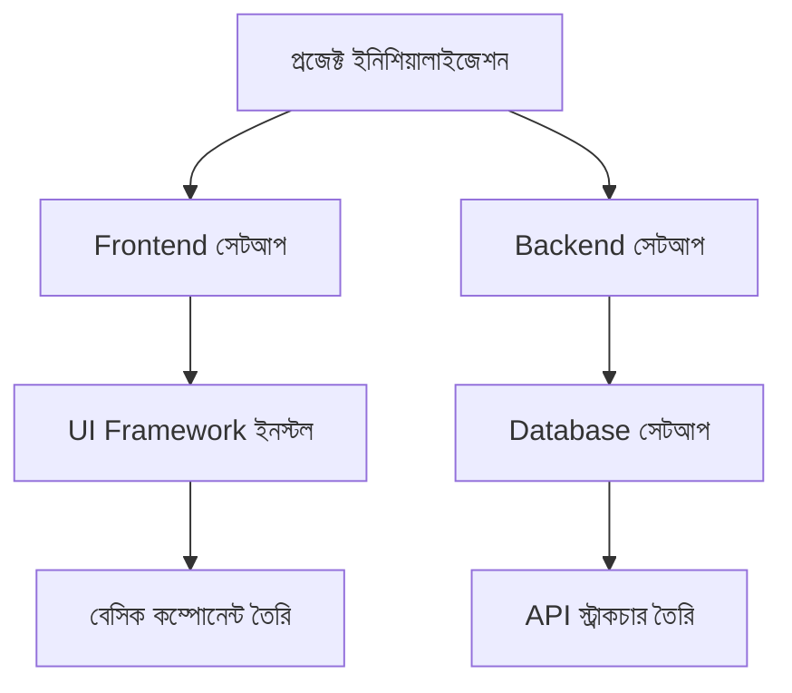
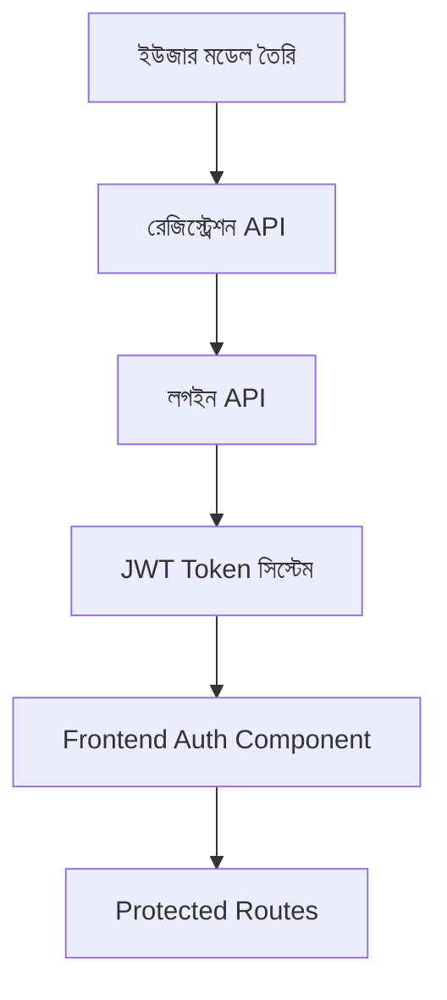
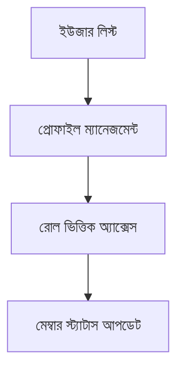
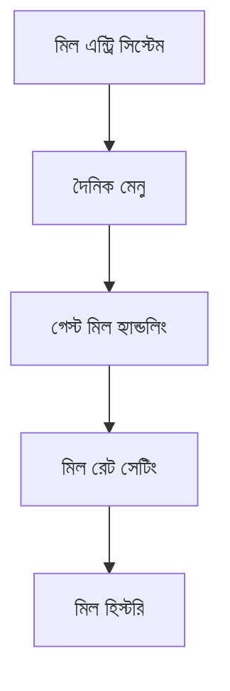
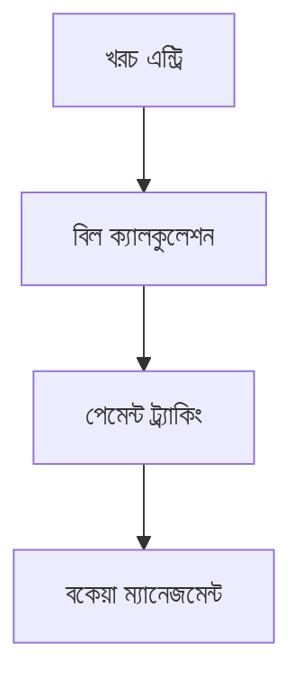
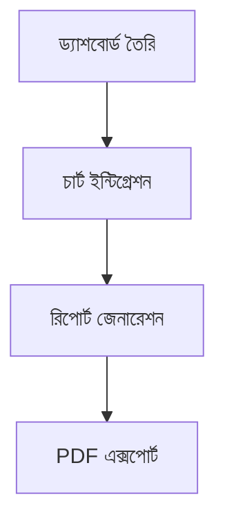
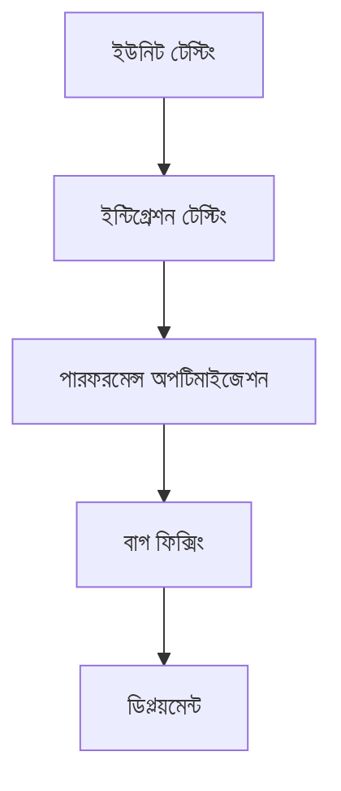

# মেস ম্যানেজমেন্ট সিস্টেম - প্রজেক্ট রিকোয়ারমেন্ট ডকুমেন্ট

## 📋 প্রজেক্ট ওভারভিউ

### প্রজেক্টের নাম

**ডিজিটাল মেস ম্যানেজমেন্ট সিস্টেম (Digital Mess Management System - DMMS)**

### প্রজেক্টের উদ্দেশ্য

প্রচলিত খাতা-কলম ভিত্তিক মেস ব্যবস্থাপনার পরিবর্তে একটি আধুনিক, ডিজিটাল এবং স্বয়ংক্রিয় সিস্টেম তৈরি করা যা:

- মেস সদস্যদের তথ্য ব্যবস্থাপনা
- খাবারের মেনু ও খরচ ট্র্যাকিং
- মাসিক বিল হিসাব ও বন্টন
- স্বচ্ছ ও নির্ভুল আর্থিক রিপোর্টিং
- সময় সাশ্রয় ও কার্যকর ব্যবস্থাপনা

## 🎯 প্রজেক্টের মূল লক্ষ্য

### 🔥 প্রাথমিক লক্ষ্য

1. **ব্যবহারকারী ব্যবস্থাপনা**: মেস সদস্য নিবন্ধন, প্রোফাইল ব্যবস্থাপনা
2. **খাবার ট্র্যাকিং**: দৈনিক খাবার গ্রহণের রেকর্ড রাখা
3. **আর্থিক হিসাব**: খরচ, বিল বন্টন ও পেমেন্ট ট্র্যাকিং
4. **রিপোর্টিং**: মাসিক/সাপ্তাহিক রিপোর্ট জেনারেশন

### 🚀 দীর্ঘমেয়াদী লক্ষ্য

1. **মোবাইল অ্যাপ্লিকেশন** তৈরি
2. **অনলাইন পেমেন্ট** ইন্টিগ্রেশন
3. **গ্রোসারি ম্যানেজমেন্ট** সিস্টেম
4. **নোটিফিকেশন সিস্টেম**

## 👥 টার্গেট ইউজার

### প্রাথমিক ব্যবহারকারী

- **মেস ম্যানেজার**: সিস্টেম পরিচালনা ও রিপোর্ট তৈরি
- **মেস সদস্য**: নিজের খাবার ও বিল ট্র্যাক করা
- **রাঁধুনি**: খাবার প্রস্তুতি ও পরিবেশনের তথ্য আপডেট

## 📊 ফিচার রিকোয়ারমেন্ট

### 🔐 অথেন্টিকেশন সিস্টেম

- **ইউজার নিবন্ধন** (Name, Phone, Email, Room Number)
- **লগইন/লগআউট** সিস্টেম
- **রোল ভিত্তিক অ্যাক্সেস** (Admin, Member, Cook)
- **পাসওয়ার্ড রিসেট** ফিচার

### 👤 ইউজার ম্যানেজমেন্ট (অ্যাডমিন)

- **প্রোফাইল ম্যানেজমেন্ট**
- **মেস সদস্য তালিকা**
- **মেম্বার স্ট্যাটাস** (Active/Inactive)
- **জয়েন/লিভ ডেট** ট্র্যাকিং

### 🍽️ মিল ম্যানেজমেন্ট

- **দৈনিক মেনু** সেট করা
- **খাবার গ্রহণ** রেকর্ড (সকাল/দুপুর/রাত)
- **গেস্ট মিল** ট্র্যাকিং
- **মিল রেট** সেটিং

### 💰 ফিন্যান্সিয়াল ম্যানেজমেন্ট

- **দৈনিক খরচ** এন্ট্রি
- **মাসিক বিল** ক্যালকুলেশন
- **মেম্বার অনুযায়ী বিল** বন্টন
- **পেমেন্ট ট্র্যাকিং**
- **বকেয়া বিল** ট্র্যাকিং

### 📈 রিপোর্টিং সিস্টেম

- **দৈনিক মিল রিপোর্ট**
- **সাপ্তাহিক খরচ রিপোর্ট**
- **মাসিক আর্থিক রিপোর্ট**
- **ব্যক্তিগত বিল স্টেটমেন্ট**

## 🛠️ টেকনিক্যাল রিকোয়ারমেন্ট

### Frontend

- **Framework**: React.js / Next.js
- **UI Library**: Shadcn / Tailwind CSS
- **Charts**: Chart.js / Recharts
- **State Management**: Redux / Context API

### Backend

- **Runtime**: Node.js
- **Framework**: Express.js / Nest.js
- **Database**: MongoDB / PostgreSQL
- **Authentication**: JWT Token
- **API**: RESTful API

### অতিরিক্ত টুলস

- **Version Control**: Git
- **API Testing**: Postman
- **Documentation**: Swagger
- **Deployment**: Vercel / Netlify (Frontend), Heroku / Railway (Backend)

## 📱 ইউজার ইন্টারফেস ডিজাইন

### ড্যাশবোর্ড ডিজাইন

```
┌─────────────────────────────────────────────────────────────┐
│                    DMMS - Dashboard                         │
├─────────────────────────────────────────────────────────────┤
│  Home  │  Members  │  Meals  │  Finance  │  Reports  │ Profile │
├─────────────────────────────────────────────────────────────┤
│                                                             │
│  📊 Today's Summary                                         │
│  ┌─────────────┬─────────────┬─────────────┬─────────────┐  │
│  │ Total Meals │   Today's   │  This Month │  Total      │  │
│  │     45      │   Cost      │   Budget    │  Members    │  │
│  │             │   ৳1,200    │   ৳25,000   │     15      │  │
│  └─────────────┴─────────────┴─────────────┴─────────────┘  │
│                                                             │
│  📅 Recent Activities                                       │
│  • নতুন মেম্বার যোগ হয়েছে - আহমেদ                          │
│  • আজকের লাঞ্চ কস্ট - ৳800                                 │
│  • রহিমের বিল পেমেন্ট - ৳2,500                             │
│                                                             │
└─────────────────────────────────────────────────────────────┘
```

## 🗃️ ডাটাবেস স্কিমা

### Users Collection

```javascript
{
  _id: ObjectId,
  name: String,
  email: String,
  phone: String,
  room_number: String,
  role: Enum['admin', 'member', 'cook'],
  join_date: Date,
  status: Enum['active', 'inactive'],
  password: String (hashed),
  created_at: Date,
  updated_at: Date
}
```

### Meals Collection

```javascript
{
  _id: ObjectId,
  user_id: ObjectId,
  date: Date,
  meal_type: Enum['breakfast', 'lunch', 'dinner'],
  guest_count: Number,
  cost_per_meal: Number, // vary on meal type
  created_at: Date
}
```

### Expenses Collection

```javascript
{
  _id: ObjectId,
  date: Date,
  description: String,
  amount: Number,
  category: Enum['groceries', 'gas', 'utilities', 'other'],
  added_by: ObjectId,
  created_at: Date
}
```

### Bills Collection

```javascript
{
  _id: ObjectId,
  user_id: ObjectId,
  month: Number,
  year: Number,
  total_meals: Number,
  meal_cost: Number,
  utility_cost: Number,
  total_amount: Number,
  paid_amount: Number,
  due_amount: Number,
  payment_status: Enum['paid', 'partial', 'unpaid'],
  created_at: Date
}
```

## 🚀 প্রজেক্ট ইমপ্লিমেন্টেশন রোডম্যাপ

### Phase 1: প্রোজেক্ট সেটআপ ও বেসিক স্ট্রাকচার (সপ্তাহ ১-২)



#### কাজের তালিকা:

- [x] প্রজেক্ট ফোল্ডার স্ট্রাকচার তৈরি
- [ ] Git রিপোজিটরি সেটআপ
- [ ] Frontend (React) প্রজেক্ট ইনিশিয়ালাইজ
- [ ] Backend (Node.js/Express) প্রজেক্ট ইনিশিয়ালাইজ
- [ ] ডাটাবেস (MongoDB) সেটআপ
- [ ] বেসিক UI লেআউট তৈরি

### Phase 2: অথেন্টিকেশন সিস্টেম (সপ্তাহ ৩-৪)



#### কাজের তালিকা:

- [ ] User Schema ডিজাইন
- [ ] Registration API endpoint
- [ ] Login API endpoint
- [ ] JWT token implementation
- [ ] Password hashing (bcrypt)
- [ ] Frontend login/register forms
- [ ] Route protection

### Phase 3: ইউজার ম্যানেজমেন্ট (সপ্তাহ ৫-৬)



#### কাজের তালিকা:

- [ ] User CRUD operations
- [ ] Profile management
- [ ] Role-based access control
- [ ] Member status management
- [ ] User list with filters

### Phase 4: মিল ম্যানেজমেন্ট সিস্টেম (সপ্তাহ ৭-৮)



#### কাজের তালিকা:

- [ ] Meal entry system
- [ ] Daily menu management
- [ ] Guest meal tracking
- [ ] Meal rate configuration
- [ ] Meal history & reports

### Phase 5: ফিন্যান্সিয়াল ম্যানেজমেন্ট (সপ্তাহ ৯-১০)



#### কাজের তালিকা:

- [ ] Expense entry system
- [ ] Monthly bill calculation
- [ ] Payment tracking
- [ ] Due amount management
- [ ] Financial reports

### Phase 6: রিপোর্টিং সিস্টেম (সপ্তাহ ১১-১২)



#### কাজের তালিকা:

- [ ] Dashboard with summary cards
- [ ] Charts & graphs integration
- [ ] Report generation
- [ ] PDF export functionality
- [ ] Email reports (optional)

### Phase 7: টেস্টিং ও অপটিমাইজেশন (সপ্তাহ ১৩-১৪)



#### কাজের তালিকা:

- [ ] Unit testing
- [ ] Integration testing
- [ ] Performance optimization
- [ ] Bug fixes
- [ ] Production deployment

## 📁 প্রজেক্ট ডিরেক্টরি স্ট্রাকচার

```
mess-management-system/
├── client/                          # Frontend (React)
│   ├── public/
│   ├── src/
│   │   ├── components/              # Reusable components
│   │   │   ├── Auth/
│   │   │   ├── Dashboard/
│   │   │   ├── Members/
│   │   │   ├── Meals/
│   │   │   └── Reports/
│   │   ├── pages/                   # Page components
│   │   ├── hooks/                   # Custom hooks
│   │   ├── services/                # API services
│   │   ├── utils/                   # Utility functions
│   │   └── styles/                  # CSS/SCSS files
│   ├── package.json
│   └── README.md
├── server/                          # Backend (Node.js)
│   ├── controllers/                 # Route controllers
│   ├── models/                      # Database models
│   ├── routes/                      # API routes
│   ├── middleware/                  # Custom middleware
│   ├── config/                      # Configuration files
│   ├── utils/                       # Utility functions
│   ├── tests/                       # Test files
│   ├── package.json
│   └── server.js
├── docs/                            # Documentation
├── .gitignore
├── README.md
└── package.json
```

## 🔧 ডেভেলপমেন্ট সেটআপ

### প্রয়োজনীয় সফটওয়্যার

- **Node.js** (v16+)
- **MongoDB** (v5+)
- **Git**
- **Code Editor** (VS Code recommended)

### ইনস্টলেশন স্টেপস

1. **Repository Clone**

   ```bash
   git clone https://github.com/username/mess-management-system.git
   cd mess-management-system
   ```

2. **Backend Setup**

   ```bash
   cd server
   npm install
   cp .env.example .env
   npm run dev
   ```

3. **Frontend Setup**

   ```bash
   cd client
   npm install
   npm start
   ```

4. **Database Setup**
   ```bash
   # MongoDB local installation অথবা MongoDB Atlas cloud setup
   ```

## 📋 টেস্টিং স্ট্র্যাটেজি

### ইউনিট টেস্টিং

- **Frontend**: Jest + React Testing Library
- **Backend**: Mocha + Chai অথবা Jest

### ইন্টিগ্রেশন টেস্টিং

- API endpoint testing
- Database integration testing
- Frontend-Backend integration

### ইউজার অ্যাক্সেপটেন্স টেস্টিং

- Manual testing scenarios
- User feedback collection

## 🚀 ডিপ্লয়মেন্ট প্ল্যান

### স্টেজিং ইনভায়রনমেন্ট

- **Frontend**: Netlify / Vercel
- **Backend**: Heroku / Railway
- **Database**: MongoDB Atlas

### প্রোডাকশন ইনভায়রনমেন্ট

- **Frontend**: CDN with custom domain
- **Backend**: VPS / Cloud hosting
- **Database**: MongoDB Atlas (paid plan)

## 💡 ভবিষ্যৎ এনহান্সমেন্ট

### শর্ট টার্ম (৩-৬ মাস)

- [ ] মোবাইল রেস্পন্সিভ ডিজাইন
- [ ] ইমেইল নোটিফিকেশন
- [ ] ডেটা এক্সপোর্ট (Excel/CSV)
- [ ] অ্যাডভান্স রিপোর্টিং

### লং টার্ম (৬-১২ মাস)

- [ ] মোবাইল অ্যাপ (React Native)
- [ ] অনলাইন পেমেন্ট গেটওয়ে
- [ ] গ্রোসারি ইনভেন্টরি ম্যানেজমেন্ট
- [ ] মাল্টি-মেস সাপোর্ট

## 🤝 টিম স্ট্রাকচার

### প্রয়োজনীয় দক্ষতা

- **Frontend Developer**: React.js, JavaScript, CSS
- **Backend Developer**: Node.js, Express.js, MongoDB
- **UI/UX Designer**: Figma, Adobe XD
- **Project Manager**: Agile methodology
- **QA Tester**: Manual & automated testing

## 📊 সাফল্যের মেট্রিক্স

### টেকনিক্যাল মেট্রিক্স

- **Page Load Time**: < 3 seconds
- **API Response Time**: < 500ms
- **Uptime**: 99.9%
- **Mobile Responsive**: 100%

### ব্যবসায়িক মেট্রিক্স

- **User Adoption Rate**: 90%+
- **Error Rate**: < 1%
- **User Satisfaction**: 4.5/5
- **Time Saved**: 70% compared to manual system

## 📞 সাপোর্ট ও ডকুমেন্টেশন

### ইউজার ডকুমেন্টেশন

- [ ] ইউজার ম্যানুয়াল
- [ ] ভিডিও টিউটোরিয়াল
- [ ] FAQ সেকশন
- [ ] টাবলশুটিং গাইড

### ডেভেলপার ডকুমেন্টেশন

- [ ] API ডকুমেন্টেশন
- [ ] কোড কমেন্ট
- [ ] আর্কিটেকচার ডায়াগ্রাম
- [ ] কন্ট্রিবিউশন গাইডলাইন

---

## 📝 সংস্করণ তথ্য

- **ডকুমেন্ট ভার্সন**: 1.0
- **সর্বশেষ আপডেট**: ২৮ মে, ২০২৫
- **পরবর্তী রিভিউ**: ১৫ জুন, ২০২৫

---


bazar management will be added here.

_এই ডকুমেন্টটি প্রজেক্টের অগ্রগতির সাথে সাথে আপডেট হতে থাকবে।_
