# 🔄 ডিজিটাল মেস ম্যানেজমেন্ট সিস্টেম - ওয়ার্কফ্লো ডায়াগ্রাম

## 📋 সিস্টেম ওভারভিউ

এই ডকুমেন্টে ডিজিটাল মেস ম্যানেজমেন্ট সিস্টেমের সম্পূর্ণ workflow এবং ব্যবহারকারীদের journey বিস্তারিতভাবে দেখানো হয়েছে।

---

## 🏠 মূল সিস্টেম আর্কিটেকচার ফ্লো

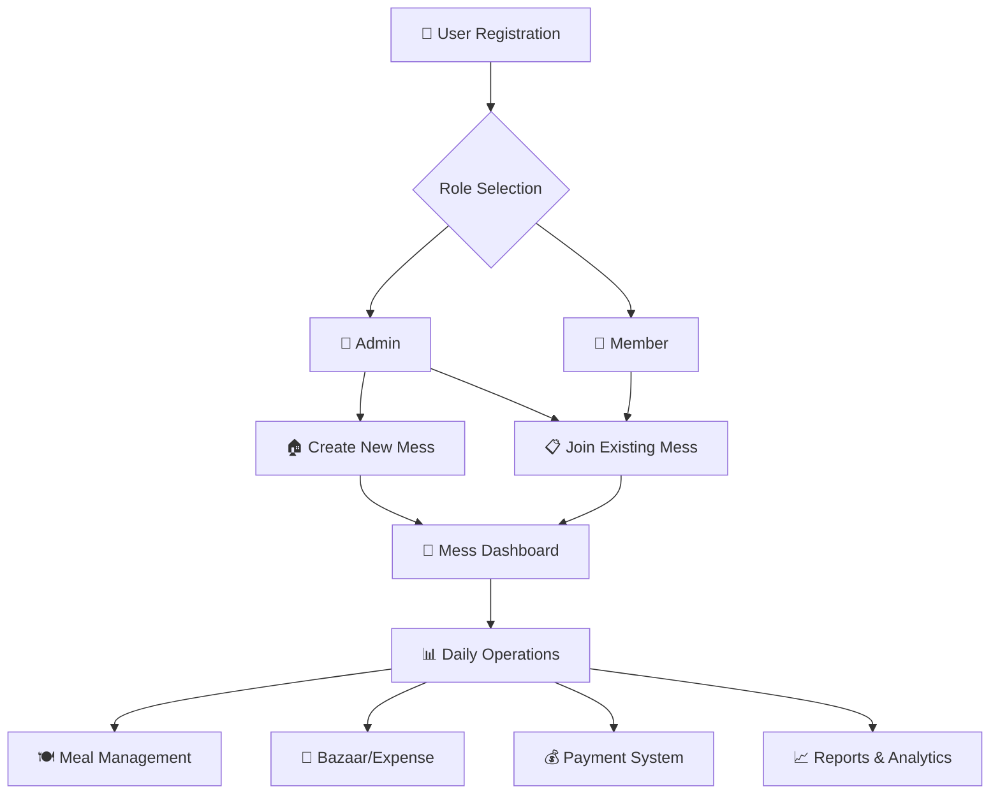
```mermaid
graph TB
    A[👤 User Registration] --> B{Role Selection}
    B --> C[🔑 Admin]
    B --> D[👥 Member]

    C --> E[🏠 Create New Mess]
    C --> F[📋 Join Existing Mess]

    D --> F

    E --> G[🎯 Mess Dashboard]
    F --> G

    G --> H[📊 Daily Operations]
    H --> I[🍽️ Meal Management]
    H --> J[🛒 Bazaar/Expense]
    H --> K[💰 Payment System]
    H --> L[📈 Reports & Analytics]
```

---

## 1️⃣ ইউজার রেজিস্ট্রেশন ও অথেন্টিকেশন ফ্লো

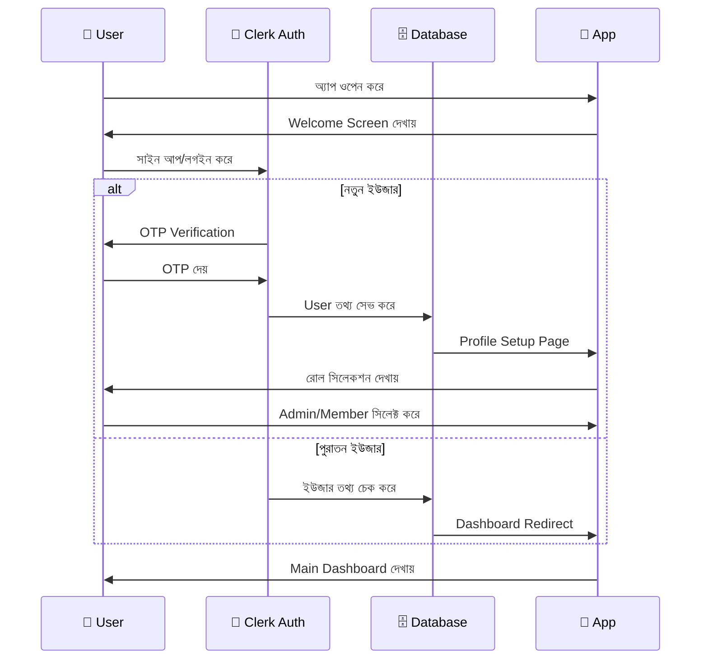
```mermaid
sequenceDiagram
    participant U as 👤 User
    participant C as 🔐 Clerk Auth
    participant DB as 🗄️ Database
    participant A as 📱 App

    U->>A: অ্যাপ ওপেন করে
    A->>U: Welcome Screen দেখায়
    U->>C: সাইন আপ/লগইন করে

    alt নতুন ইউজার
        C->>U: OTP Verification
        U->>C: OTP দেয়
        C->>DB: User তথ্য সেভ করে
        DB->>A: Profile Setup Page
        A->>U: রোল সিলেকশন দেখায়
        U->>A: Admin/Member সিলেক্ট করে
    else পুরাতন ইউজার
        C->>DB: ইউজার তথ্য চেক করে
        DB->>A: Dashboard Redirect
    end

    A->>U: Main Dashboard দেখায়
```

### 🔑 রেজিস্ট্রেশন স্টেপস:

1. **📱 অ্যাপ ওপেন** → Welcome Screen
2. **📞 ফোন নম্বর** → OTP ভেরিফিকেশন
3. **👤 প্রোফাইল তথ্য** → নাম, ইমেইল, ছবি
4. **🎯 রোল সিলেকশন** → Admin/Member
5. **🏠 মেস সিলেকশন** → নতুন তৈরি/যোগদান

---

## 2️⃣ মেস সেটআপ ও ম্যানেজমেন্ট ফ্লো

### 🆕 নতুন মেস তৈরি (অ্যাডমিন)

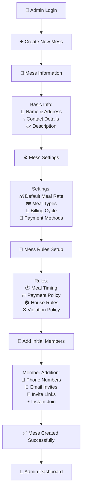
```mermaid
flowchart TD
    A[🔑 Admin Login] --> B[➕ Create New Mess]
    B --> C[📝 Mess Information]

    C --> D[Basic Info:<br/>📍 Name & Address<br/>📞 Contact Details<br/>📋 Description]

    D --> E[⚙️ Mess Settings]
    E --> F[Settings:<br/>💰 Default Meal Rate<br/>🍽️ Meal Types<br/>📅 Billing Cycle<br/>📱 Payment Methods]

    F --> G[📜 Mess Rules Setup]
    G --> H[Rules:<br/>🕒 Meal Timing<br/>💵 Payment Policy<br/>🏠 House Rules<br/>❌ Violation Policy]

    H --> I[👥 Add Initial Members]
    I --> J[Member Addition:<br/>📱 Phone Numbers<br/>📧 Email Invites<br/>🔗 Invite Links<br/>⚡ Instant Join]

    J --> K[✅ Mess Created Successfully]
    K --> L[🎯 Admin Dashboard]
```

### 🤝 মেস জয়েন প্রক্রিয়া (মেম্বার)

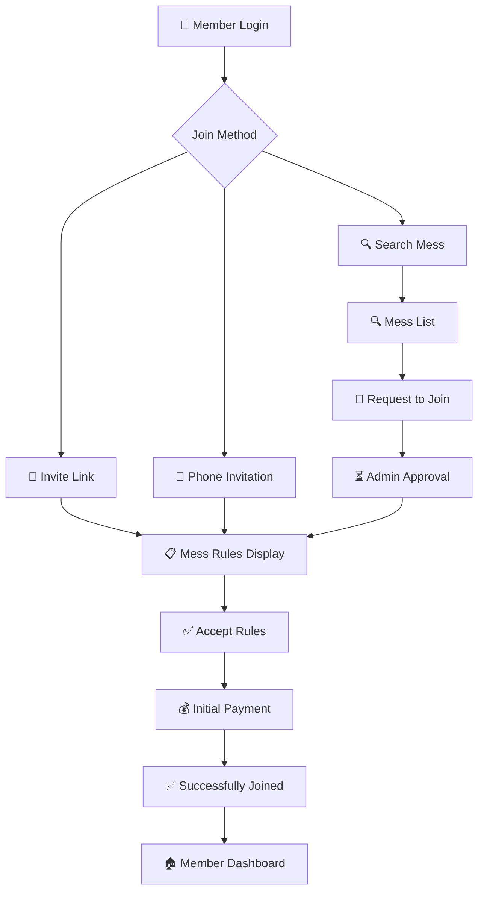
```mermaid
flowchart TD
    A[👤 Member Login] --> B{Join Method}

    B --> C[🔗 Invite Link]
    B --> D[📱 Phone Invitation]
    B --> E[🔍 Search Mess]

    C --> F[📋 Mess Rules Display]
    D --> F
    E --> G[🔍 Mess List]
    G --> H[📱 Request to Join]
    H --> I[⏳ Admin Approval]
    I --> F

    F --> J[✅ Accept Rules]
    J --> K[💰 Initial Payment]
    K --> L[✅ Successfully Joined]
    L --> M[🏠 Member Dashboard]
```

---

## 3️⃣ দৈনিক মিল ম্যানেজমেন্ট ফ্লো

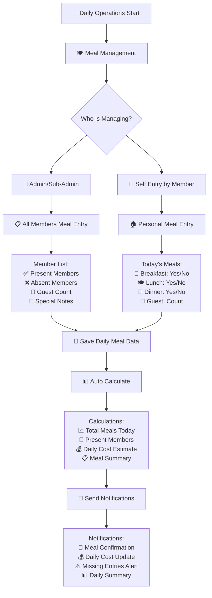
```mermaid
flowchart TB
    A[🌅 Daily Operations Start] --> B[🍽️ Meal Management]

    B --> C{Who is Managing?}

    C --> D[🔑 Admin/Sub-Admin]
    C --> E[👤 Self Entry by Member]

    D --> F[📋 All Members Meal Entry]
    F --> G[Member List:<br/>✅ Present Members<br/>❌ Absent Members<br/>👥 Guest Count<br/>📝 Special Notes]

    E --> H[🏠 Personal Meal Entry]
    H --> I[Today's Meals:<br/>🌅 Breakfast: Yes/No<br/>🍽️ Lunch: Yes/No<br/>🌙 Dinner: Yes/No<br/>👥 Guest: Count]

    G --> J[💾 Save Daily Meal Data]
    I --> J

    J --> K[📊 Auto Calculate]
    K --> L[Calculations:<br/>📈 Total Meals Today<br/>👥 Present Members<br/>💰 Daily Cost Estimate<br/>📋 Meal Summary]

    L --> M[📱 Send Notifications]
    M --> N[Notifications:<br/>📧 Meal Confirmation<br/>💰 Daily Cost Update<br/>⚠️ Missing Entries Alert<br/>📊 Daily Summary]
```

### 🕒 মিল এন্ট্রি টাইমিং সিস্টেম

```mermaid
gantt
    title দৈনিক মিল এন্ট্রি সময়সূচী
    dateFormat HH:mm
    axisFormat %H:%M

    section ব্রেকফাস্ট
    Entry Time    :06:00, 10:00
    Late Entry    :10:00, 11:00

    section লাঞ্চ
    Entry Time    :11:00, 15:00
    Late Entry    :15:00, 16:00

    section ডিনার
    Entry Time    :17:00, 22:00
    Late Entry    :22:00, 23:59
```

---

## 4️⃣ বাজার ও খরচ ব্যবস্থাপনা ফ্লো

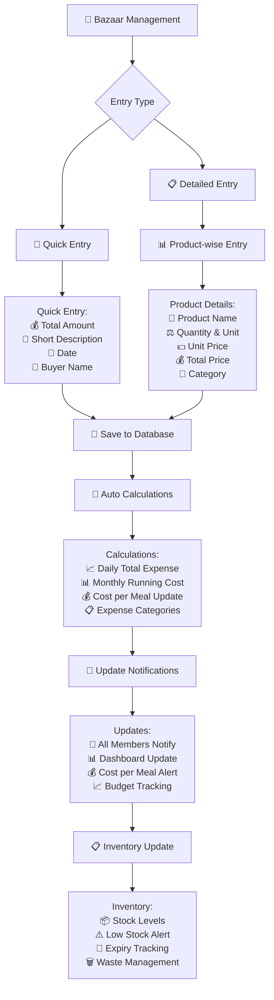
```mermaid
flowchart TD
    A[🛒 Bazaar Management] --> B{Entry Type}

    B --> C[📱 Quick Entry]
    B --> D[📋 Detailed Entry]

    C --> E[Quick Entry:<br/>💰 Total Amount<br/>📝 Short Description<br/>📅 Date<br/>👤 Buyer Name]

    D --> F[📊 Product-wise Entry]
    F --> G[Product Details:<br/>🥬 Product Name<br/>⚖️ Quantity & Unit<br/>💵 Unit Price<br/>💰 Total Price<br/>📂 Category]

    E --> H[💾 Save to Database]
    G --> H

    H --> I[🔄 Auto Calculations]
    I --> J[Calculations:<br/>📈 Daily Total Expense<br/>📊 Monthly Running Cost<br/>💰 Cost per Meal Update<br/>📋 Expense Categories]

    J --> K[📱 Update Notifications]
    K --> L[Updates:<br/>👥 All Members Notify<br/>📊 Dashboard Update<br/>💰 Cost per Meal Alert<br/>📈 Budget Tracking]

    L --> M[📋 Inventory Update]
    M --> N[Inventory:<br/>📦 Stock Levels<br/>⚠️ Low Stock Alert<br/>📅 Expiry Tracking<br/>🗑️ Waste Management]
```

### 🛒 বাজার এন্ট্রি ফর্ম ফ্লো

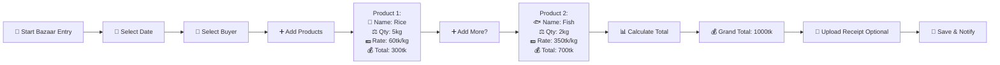
```mermaid
flowchart LR
    A[🛒 Start Bazaar Entry] --> B[📅 Select Date]
    B --> C[👤 Select Buyer]
    C --> D[➕ Add Products]

    D --> E[Product 1:\n🥬 Name: Rice\n⚖️ Qty: 5kg\n💵 Rate: 60tk/kg\n💰 Total: 300tk]

    E --> F[➕ Add More?]
    F --> G[Product 2:\n🐟 Name: Fish\n⚖️ Qty: 2kg\n💵 Rate: 350tk/kg\n💰 Total: 700tk]

    G --> H[📊 Calculate Total]
    H --> I[💰 Grand Total: 1000tk]
 I --> J[📸 Upload Receipt Optional]
    J --> K[💾 Save & Notify]

```

---

## 5️⃣ বিলিং ও পেমেন্ট সিস্টেম ফ্লো

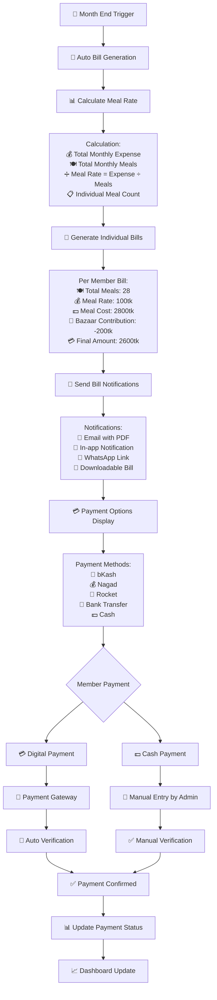
```mermaid
flowchart TB
    A[📅 Month End Trigger] --> B[🧮 Auto Bill Generation]

    B --> C[📊 Calculate Meal Rate]
    C --> D[Calculation:<br/>💰 Total Monthly Expense<br/>🍽️ Total Monthly Meals<br/>➗ Meal Rate = Expense ÷ Meals<br/>📋 Individual Meal Count]

    D --> E[👥 Generate Individual Bills]
    E --> F[Per Member Bill:<br/>🍽️ Total Meals: 28<br/>💰 Meal Rate: 100tk<br/>💵 Meal Cost: 2800tk<br/>🛒 Bazaar Contribution: -200tk<br/>💳 Final Amount: 2600tk]

    F --> G[📨 Send Bill Notifications]
    G --> H[Notifications:<br/>📧 Email with PDF<br/>📱 In-app Notification<br/>💬 WhatsApp Link<br/>📄 Downloadable Bill]

    H --> I[💳 Payment Options Display]
    I --> J[Payment Methods:<br/>📱 bKash<br/>💰 Nagad<br/>🚀 Rocket<br/>🏦 Bank Transfer<br/>💵 Cash]

    J --> K{Member Payment}
    K --> L[💳 Digital Payment]
    K --> M[💵 Cash Payment]

    L --> N[📱 Payment Gateway]
    N --> O[🔄 Auto Verification]

    M --> P[📝 Manual Entry by Admin]
    P --> Q[✅ Manual Verification]

    O --> R[✅ Payment Confirmed]
    Q --> R

    R --> S[📊 Update Payment Status]
    S --> T[📈 Dashboard Update]
```

### 💳 বাংলাদেশি পেমেন্ট গেটওয়ে ইন্টিগ্রেশন

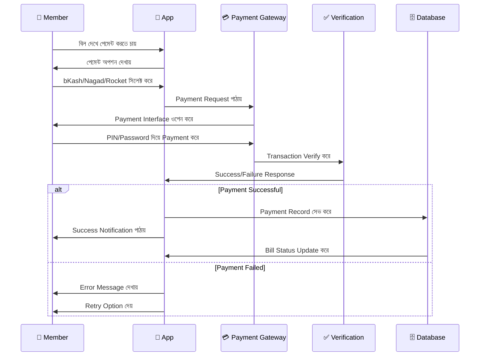
```mermaid
sequenceDiagram
    participant M as 👤 Member
    participant A as 📱 App
    participant P as 💳 Payment Gateway
    participant V as ✅ Verification
    participant D as 🗄️ Database

    M->>A: বিল দেখে পেমেন্ট করতে চায়
    A->>M: পেমেন্ট অপশন দেখায়
    M->>A: bKash/Nagad/Rocket সিলেক্ট করে

    A->>P: Payment Request পাঠায়
    P->>M: Payment Interface ওপেন করে
    M->>P: PIN/Password দিয়ে Payment করে

    P->>V: Transaction Verify করে
    V->>A: Success/Failure Response

    alt Payment Successful
        A->>D: Payment Record সেভ করে
        A->>M: Success Notification পাঠায়
        D->>A: Bill Status Update করে
    else Payment Failed
        A->>M: Error Message দেখায়
        A->>M: Retry Option দেয়
    end
```

---

## 6️⃣ রিপোর্ট ও অ্যানালিটিক্স ফ্লো

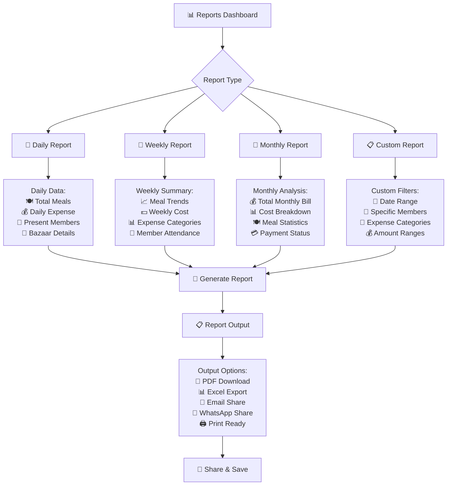
```mermaid
flowchart TD
    A[📊 Reports Dashboard] --> B{Report Type}

    B --> C[📅 Daily Report]
    B --> D[📃 Weekly Report]
    B --> E[📑 Monthly Report]
    B --> F[📋 Custom Report]

    C --> G[Daily Data:<br/>🍽️ Total Meals<br/>💰 Daily Expense<br/>👥 Present Members<br/>🛒 Bazaar Details]

    D --> H[Weekly Summary:<br/>📈 Meal Trends<br/>💵 Weekly Cost<br/>📊 Expense Categories<br/>👥 Member Attendance]

    E --> I[Monthly Analysis:<br/>💰 Total Monthly Bill<br/>📊 Cost Breakdown<br/>🍽️ Meal Statistics<br/>💳 Payment Status]

    F --> J[Custom Filters:<br/>📅 Date Range<br/>👤 Specific Members<br/>🛒 Expense Categories<br/>💰 Amount Ranges]

    G --> K[📄 Generate Report]
    H --> K
    I --> K
    J --> K

    K --> L[📋 Report Output]
    L --> M[Output Options:<br/>📄 PDF Download<br/>📊 Excel Export<br/>📧 Email Share<br/>📱 WhatsApp Share<br/>🖨️ Print Ready]

    M --> N[📨 Share & Save]
```

### 📈 রিয়েল-টাইম অ্যানালিটিক্স ড্যাশবোর্ড

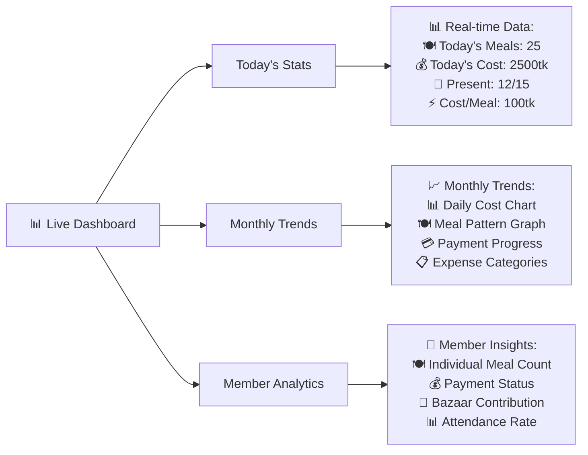
```mermaid
flowchart LR
    A[📊 Live Dashboard] --> B[Today's Stats]
    A --> C[Monthly Trends]
    A --> D[Member Analytics]

    B --> E[📊 Real-time Data:<br/>🍽️ Today's Meals: 25<br/>💰 Today's Cost: 2500tk<br/>👥 Present: 12/15<br/>⚡ Cost/Meal: 100tk]

    C --> F[📈 Monthly Trends:<br/>📊 Daily Cost Chart<br/>🍽️ Meal Pattern Graph<br/>💳 Payment Progress<br/>📋 Expense Categories]

    D --> G[👥 Member Insights:<br/>🍽️ Individual Meal Count<br/>💰 Payment Status<br/>🛒 Bazaar Contribution<br/>📊 Attendance Rate]
```

---

## 7️⃣ নোটিফিকেশন ও কমিউনিকেশন ফ্লো

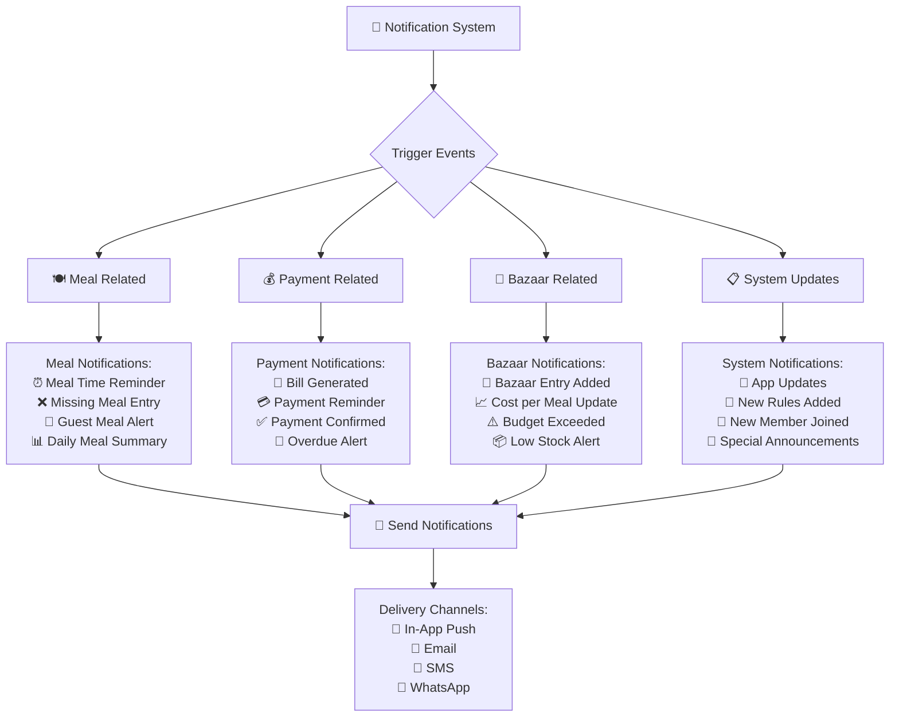
```mermaid
flowchart TD
    A[🔔 Notification System] --> B{Trigger Events}

    B --> C[🍽️ Meal Related]
    B --> D[💰 Payment Related]
    B --> E[🛒 Bazaar Related]
    B --> F[📋 System Updates]

    C --> G[Meal Notifications:<br/>⏰ Meal Time Reminder<br/>❌ Missing Meal Entry<br/>👥 Guest Meal Alert<br/>📊 Daily Meal Summary]

    D --> H[Payment Notifications:<br/>📧 Bill Generated<br/>💳 Payment Reminder<br/>✅ Payment Confirmed<br/>🔴 Overdue Alert]

    E --> I[Bazaar Notifications:<br/>🛒 Bazaar Entry Added<br/>📈 Cost per Meal Update<br/>⚠️ Budget Exceeded<br/>📦 Low Stock Alert]

    F --> J[System Notifications:<br/>📱 App Updates<br/>📜 New Rules Added<br/>👥 New Member Joined<br/>🎉 Special Announcements]

    G --> K[📨 Send Notifications]
    H --> K
    I --> K
    J --> K

    K --> L[Delivery Channels:<br/>📱 In-App Push<br/>📧 Email<br/>📲 SMS<br/>💬 WhatsApp]
```

### 📱 স্মার্ট নোটিফিকেশন টাইমিং

```mermaid
gantt
    title দৈনিক নোটিফিকেশন সময়সূচী
    dateFormat HH:mm
    axisFormat %H:%M

    section সকালের নোটিফিকেশন
    Good Morning         :07:00, 07:01
    Breakfast Reminder   :08:00, 08:01

    section দুপুরের নোটিফিকেশন
    Lunch Reminder       :12:00, 12:01
    Cost Update          :15:00, 15:01

    section সন্ধ্যার নোটিফিকেশন
    Dinner Reminder      :18:00, 18:01
    Daily Summary        :22:00, 22:01

    section মাসিক নোটিফিকেশন
    Bill Generation      :07:00, 07:01
    Payment Reminder     :08:00, 08:01

```

---

## 8️⃣ ফিডব্যাক ও কোয়ালিটি ম্যানেজমেন্ট ফ্লো

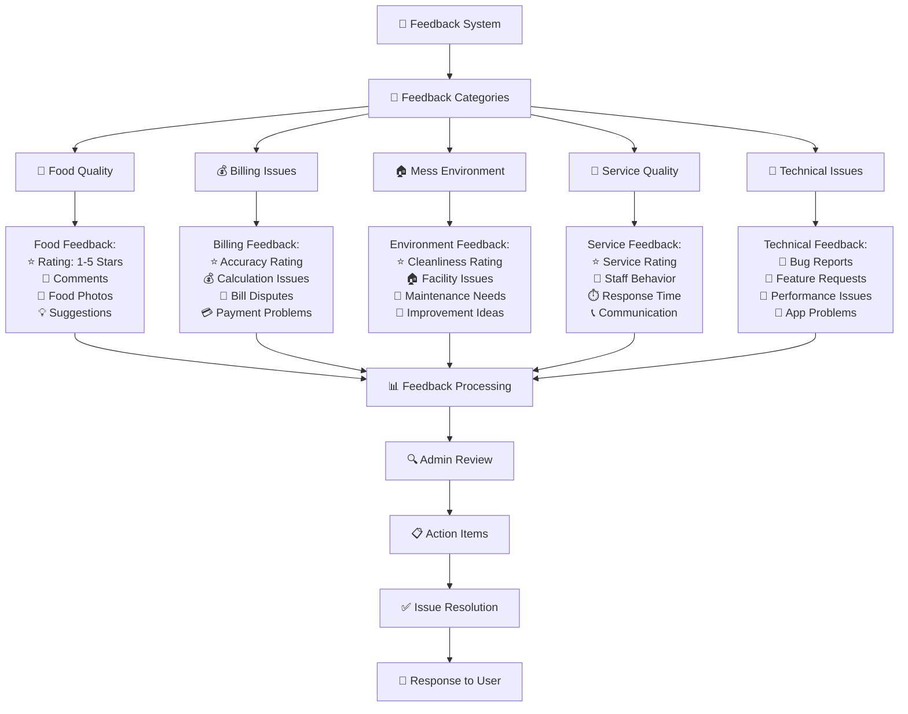
```mermaid
flowchart TD
    A[💬 Feedback System] --> B[📝 Feedback Categories]

    B --> C[🍛 Food Quality]
    B --> D[💰 Billing Issues]
    B --> E[🏠 Mess Environment]
    B --> F[👥 Service Quality]
    B --> G[🐛 Technical Issues]

    C --> H[Food Feedback:<br/>⭐ Rating: 1-5 Stars<br/>📝 Comments<br/>📸 Food Photos<br/>💡 Suggestions]

    D --> I[Billing Feedback:<br/>⭐ Accuracy Rating<br/>💰 Calculation Issues<br/>🧾 Bill Disputes<br/>💳 Payment Problems]

    E --> J[Environment Feedback:<br/>⭐ Cleanliness Rating<br/>🏠 Facility Issues<br/>🔧 Maintenance Needs<br/>🎯 Improvement Ideas]

    F --> K[Service Feedback:<br/>⭐ Service Rating<br/>👥 Staff Behavior<br/>⏱️ Response Time<br/>📞 Communication]

    G --> L[Technical Feedback:<br/>🐛 Bug Reports<br/>🚀 Feature Requests<br/>🔄 Performance Issues<br/>📱 App Problems]

    H --> M[📊 Feedback Processing]
    I --> M
    J --> M
    K --> M
    L --> M

    M --> N[🔍 Admin Review]
    N --> O[📋 Action Items]
    O --> P[✅ Issue Resolution]
    P --> Q[📧 Response to User]
```

---

## 9️⃣ ডেটা ব্যাকআপ ও সিকিউরিটি ফ্লো

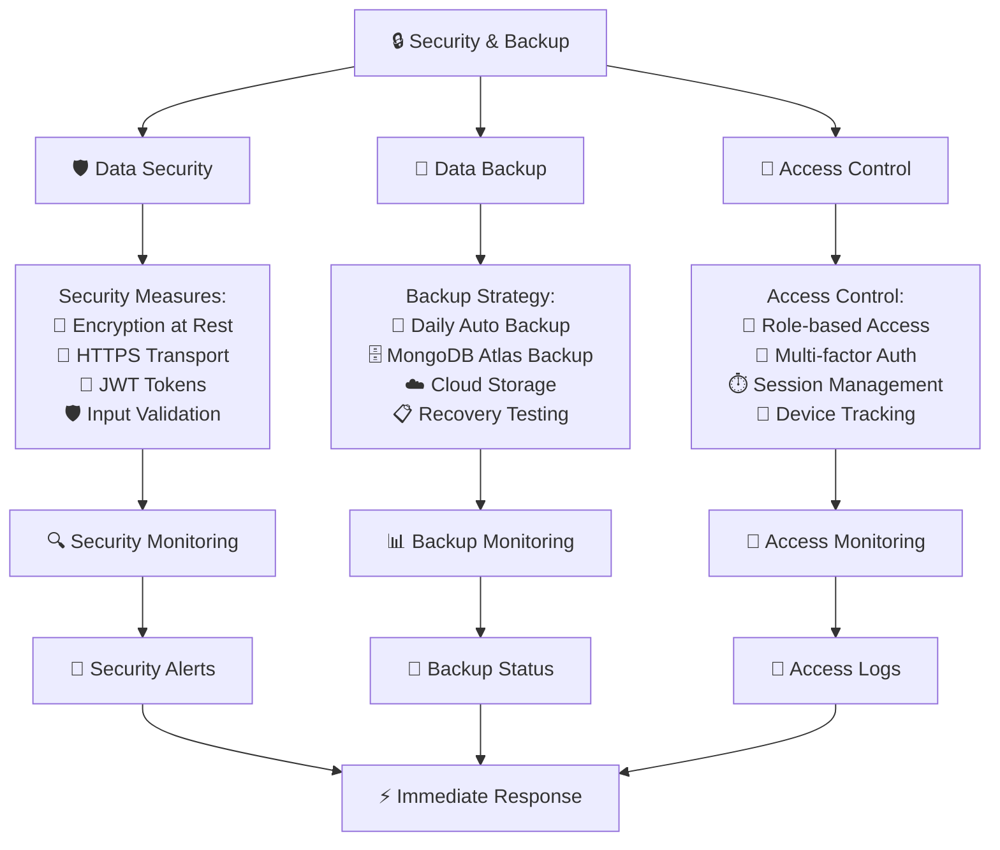
```mermaid
flowchart TB
    A[🔒 Security & Backup] --> B[🛡️ Data Security]
    A --> C[💾 Data Backup]
    A --> D[🔐 Access Control]

    B --> E[Security Measures:<br/>🔐 Encryption at Rest<br/>🚀 HTTPS Transport<br/>🔑 JWT Tokens<br/>🛡️ Input Validation]

    C --> F[Backup Strategy:<br/>📅 Daily Auto Backup<br/>🗄️ MongoDB Atlas Backup<br/>☁️ Cloud Storage<br/>📋 Recovery Testing]

    D --> G[Access Control:<br/>👤 Role-based Access<br/>🔑 Multi-factor Auth<br/>⏱️ Session Management<br/>📱 Device Tracking]

    E --> H[🔍 Security Monitoring]
    F --> I[📊 Backup Monitoring]
    G --> J[👥 Access Monitoring]

    H --> K[🚨 Security Alerts]
    I --> L[📧 Backup Status]
    J --> M[🔔 Access Logs]

    K --> N[⚡ Immediate Response]
    L --> N
    M --> N
```

---

## 🔟 মোবাইল PWA ও অফলাইন ফিচার ফ্লো

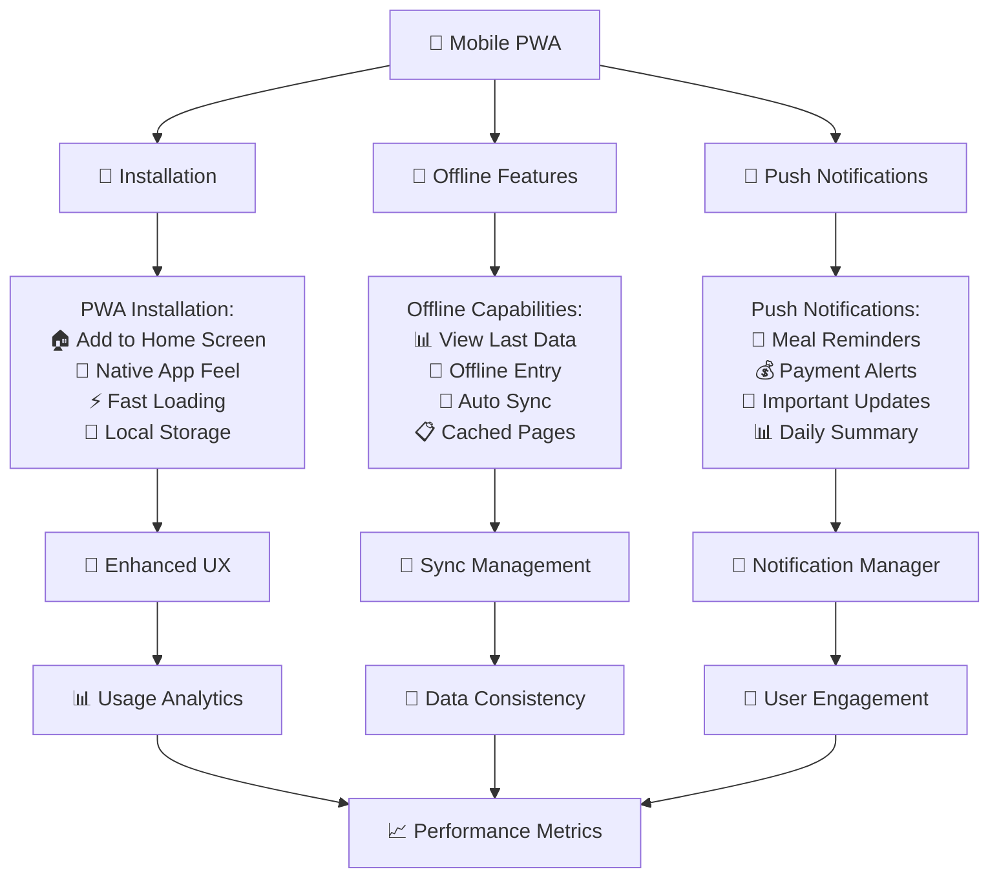
```mermaid
flowchart TD
    A[📱 Mobile PWA] --> B[📲 Installation]
    A --> C[🔄 Offline Features]
    A --> D[🔔 Push Notifications]

    B --> E[PWA Installation:<br/>🏠 Add to Home Screen<br/>📱 Native App Feel<br/>⚡ Fast Loading<br/>💾 Local Storage]

    C --> F[Offline Capabilities:<br/>📊 View Last Data<br/>📝 Offline Entry<br/>🔄 Auto Sync<br/>📋 Cached Pages]

    D --> G[Push Notifications:<br/>🔔 Meal Reminders<br/>💰 Payment Alerts<br/>📧 Important Updates<br/>📊 Daily Summary]

    E --> H[📱 Enhanced UX]
    F --> I[🔄 Sync Management]
    G --> J[🔔 Notification Manager]

    H --> K[📊 Usage Analytics]
    I --> L[💾 Data Consistency]
    J --> M[👤 User Engagement]

    K --> N[📈 Performance Metrics]
    L --> N
    M --> N
```

---

## 🎯 কমপ্লিট ইউজার জার্নি ম্যাপ

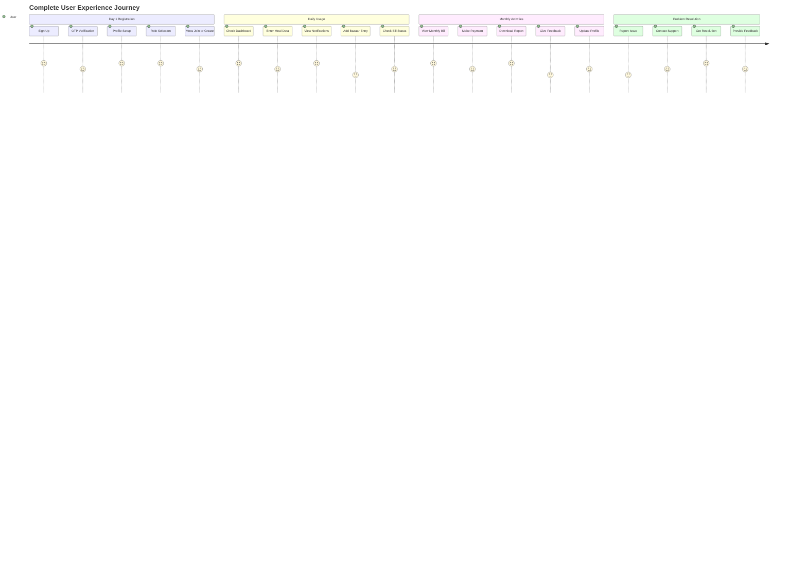
```mermaid
journey
    title Complete User Experience Journey

    section Day 1 Registration
      Sign Up            : 5: User
      OTP Verification   : 4: User
      Profile Setup      : 5: User
      Role Selection     : 5: User
      Mess Join or Create: 4: User

    section Daily Usage
      Check Dashboard     : 5: User
      Enter Meal Data     : 4: User
      View Notifications  : 5: User
      Add Bazaar Entry    : 3: User
      Check Bill Status   : 4: User

    section Monthly Activities
      View Monthly Bill   : 5: User
      Make Payment        : 4: User
      Download Report     : 5: User
      Give Feedback       : 3: User
      Update Profile      : 4: User

    section Problem Resolution
      Report Issue        : 3: User
      Contact Support     : 4: User
      Get Resolution      : 5: User
      Provide Feedback    : 4: User
```

---

## 📊 সিস্টেম পারফরমেন্স ও মনিটরিং

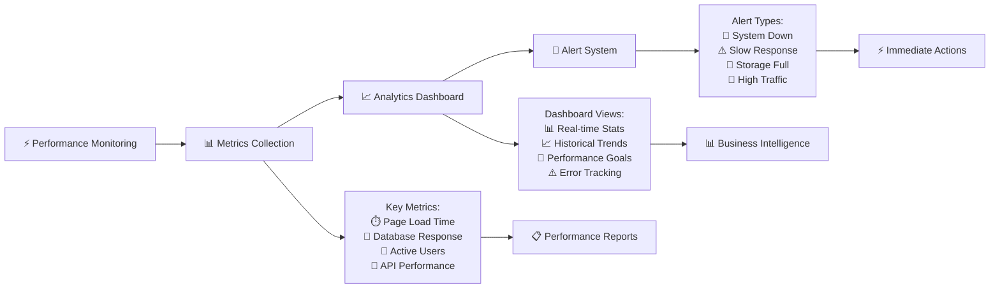
```mermaid
flowchart LR
    A[⚡ Performance Monitoring] --> B[📊 Metrics Collection]
    B --> C[📈 Analytics Dashboard]
    C --> D[🚨 Alert System]

    B --> E[Key Metrics:<br/>⏱️ Page Load Time<br/>💾 Database Response<br/>👥 Active Users<br/>🔄 API Performance]

    C --> F[Dashboard Views:<br/>📊 Real-time Stats<br/>📈 Historical Trends<br/>🎯 Performance Goals<br/>⚠️ Error Tracking]

    D --> G[Alert Types:<br/>🚨 System Down<br/>⚠️ Slow Response<br/>💾 Storage Full<br/>👥 High Traffic]

    E --> H[📋 Performance Reports]
    F --> I[📊 Business Intelligence]
    G --> J[⚡ Immediate Actions]
```

---

## 🎉 সিস্টেম সাকসেস মেট্রিক্স

### 📈 মূল পারফরমেন্স সূচক (KPIs)

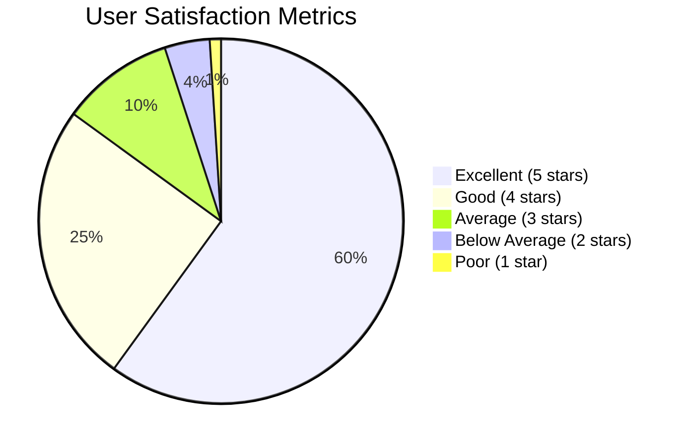
```mermaid
pie title User Satisfaction Metrics
    "Excellent (5 stars)" : 60
    "Good (4 stars)" : 25
    "Average (3 stars)" : 10
    "Below Average (2 stars)" : 4
    "Poor (1 star)" : 1
```

### 📊 সিস্টেম ব্যবহার পরিসংখ্যান

```mermaid
xychart-beta
    title "Monthly Active Users Growth"
    x-axis [Jan, Feb, Mar, Apr, May, Jun]
    y-axis "Users" 0 --> 1000
    bar [100, 250, 400, 600, 800, 1000]
```

### 🎯 ব্যবসায়িক লক্ষ্য অর্জন

| মেট্রিক           | লক্ষ্য     | বর্তমান অবস্থা | স্ট্যাটাস |
| ----------------- | ---------- | -------------- | --------- |
| 👥 একটিভ ইউজার    | ১০০০+      | ৮৫০            | 🟡 ৮৫%    |
| ⏱️ রেসপন্স টাইম   | <২ সেকেন্ড | ১.৫ সেকেন্ড    | ✅ ১২৫%   |
| 💳 পেমেন্ট সাকসেস | ৯৫%+       | ৯৭%            | ✅ ১০২%   |
| 🐛 বাগ রিপোর্ট    | <৫/মাস     | ৩/মাস          | ✅ ১৬৭%   |
| ⭐ ইউজার রেটিং    | ৪.৫+       | ৪.৭            | ✅ ১০৪%   |

---

## 🚀 ভবিষ্যত উন্নয়ন রোডম্যাপ

```mermaid
timeline
    title Digital Mess Management Roadmap

    Phase 1 : Core MVP
            : User Authentication
            : Basic Meal Management
            : Simple Billing
            : Payment Integration

    Phase 2 : Enhanced Features
            : Advanced Analytics
            : Mobile PWA
            : Notification System
            : Feedback Management

    Phase 3 : AI Integration
            : Smart Predictions
            : Cost Optimization
            : Menu Recommendations
            : Automated Ordering

    Phase 4 : Business Growth
            : Multi-mess Support
            : Franchise Model
            : Third-party Integrations
            : White-label Solutions
```

---

## 🎯 সংক্ষিপ্ত সিস্টেম সামারি

এই ডিজিটাল মেস ম্যানেজমেন্ট সিস্টেম একটি comprehensive সমাধান যা:

### ✅ **সমাধান করে:**

- 📊 ম্যানুয়াল হিসাব-নিকাশের ঝামেলা
- 💰 ভুল বিল ক্যালকুলেশন
- 📱 পেমেন্ট ট্র্যাকিং সমস্যা
- 🔄 স্বচ্ছতার অভাব
- 📋 রেকর্ড রাখার জটিলতা

### 🎁 **প্রদান করে:**

- 🔄 সম্পূর্ণ অটোমেশন
- 📊 রিয়েল-টাইম ড্যাটা
- 💳 সহজ পেমেন্ট সিস্টেম
- 📱 মোবাইল-বান্ধব ইন্টারফেস
- 🛡️ নিরাপদ ডেটা ব্যবস্থাপনা

### 🌟 **বিশেষত্ব:**

- 🇧🇩 বাংলাদেশি মেস কালচারের সাথে সামঞ্জস্যপূর্ণ
- 💳 স্থানীয় পেমেন্ট গেটওয়ে সাপোর্ট
- 📱 PWA সাপোর্ট সহ অফলাইন ক্ষমতা
- 🔔 স্মার্ট নোটিফিকেশন সিস্টেম
- 📊 বিস্তারিত অ্যানালিটিক্স ও রিপোর্টিং

---

**🎯 এই workflow document টি সিস্টেমের সম্পূর্ণ কার্যপ্রণালী বুঝতে সাহায্য করবে এবং ডেভেলপমেন্ট টিমের জন্য একটি clear roadmap প্রদান করবে।**

## 🎯 মূল বৈশিষ্ট্য:

### 📊 **১০টি বিস্তারিত ওয়ার্কফ্লো:**

1. **ইউজার রেজিস্ট্রেশন ও অথেন্টিকেশন** - Clerk integration সহ
2. **মেস সেটআপ ও ম্যানেজমেন্ট** - Admin/Member journey
3. **দৈনিক মিল ব্যবস্থাপনা** - Real-time tracking
4. **বাজার ও খরচ ব্যবস্থাপনা** - Product-wise entry
5. **বিলিং ও পেমেন্ট সিস্টেম** - bKash/Nagad integration
6. **রিপোর্ট ও অ্যানালিটিক্স** - Comprehensive reporting
7. **নোটিফিকেশন সিস্টেম** - Smart alerts
8. **ফিডব্যাক ম্যানেজমেন্ট** - Quality control
9. **সিকিউরিটি ও ব্যাকআপ** - Data protection
10. **মোবাইল PWA** - Offline features

### 🔥 **ভিজুয়াল ডায়াগ্রাম:**

- **Mermaid charts** দিয়ে সুন্দর flowcharts
- **Sequence diagrams** দিয়ে step-by-step process
- **Timeline charts** দিয়ে future roadmap
- **Pie charts** দিয়ে success metrics

### 📱 **ব্যবহারকারী অভিজ্ঞতা:**

- Complete user journey mapping
- Real-time performance monitoring
- Success metrics ও KPIs
- Future development roadmap

এই workflow document টি development team এর জন্য একটি complete blueprint হিসেবে কাজ করবে এবং সিস্টেমের প্রতিটি component কিভাবে কাজ করে তা clearly বুঝতে সাহায্য করবে।
